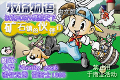

# 金手指

## 警告

金手指会严重破坏游戏性，让你丧失对这个游戏的兴趣。  
还有可能导致各种 BUG，用之前请务必 备份存档 。

## 金手指

一般金手指的格式为 YYYYYYYY:XX，

出于某些原因，金手指的地址会发生便宜

而数据是不会偏移的，所以可以很简单的计算偏移量。

比如你找到的修改金钱的金手指地址是 02004080H(16 进制)

而自己在模拟器上搜索到的金钱的金手指地址是 020068B4H

这就意味着你的所有金手指都便宜了 020068B4H-02004080H=+2834H

经过长期实践发现，大部分金手指要么不偏移，要么便宜+2834H

本攻略中的金手指基于模拟天下汉化的《牧场物语 重聚矿石镇 男孩版》。

其他汉化版本因内容、字库不同，可能并不能使用本文中的金手指，具体请参考上文中的偏移教程。

游戏 ROM 的校验信息为

CRC32: FF11476C

CRC64: 2B8C2AC347E306FC

SHA1: dcfedd993c077d3510903c45171a7951da579b09

SHA256: 5cad7606421bbdcff957fb397481eadf2baa8fb01a46a11e972d5d91c0133fc9

模拟器：VisualBoyAdvance(1.8CN)

模拟器的校验信息为

SHA256: d6920b52db15ea9fb558e0e323f1c1ffed1459b38d7e61f7b368b04773dc1796

### 金钱

男生版 02004080:3B9AC9FF

女生版 02004090:3B9AC9FF

金钱是牧场的灵魂之一，所以就有人打起小九九，想调金钱。

但你要知道，调得多是好，但一些超级便宜的东西买不了。

例如打不了电话（才 10G）杂货店旁边那一排东西买不了（背包啊，箩筐啊那些）

这些东西买不了可不得了啊。

### 体力最大

020041F4:FF

### 别墅

020025D8:XX

如果这金手指不行,

请用 02004E0C:XX

XX ↓\* 01:山

- 02:街
- 04:海
- 07:所有

### 修改天气

修改天气的 GBA 金手指版 020025E4:XXXX

这个不行用 02004E18:XXXX

- 晴天 0000
- 雨天 0001
- 雪 0002
- 台风 0003
- 大雪 0004

### 家

020027CC:XX

- 小 00
- 中 01
- 大 02

### 所有家具

020027CC:AA  
020027CD:FF  
020027CE:00  
020027CF:FF  
020027D0:FF  
020027D1:FF

### 资材数

020025FC:XXXX

### 计步器

020041F8:XXXXXXXX

### 好感度

#### 狗好感

02004262:FFFF

(冠军: 02004261:FF)

#### 马好感

0200261A:FFFF

(冠军: 02002618:FFFF)

#### 鸡好感

02002A1E:FF

02002A4E:FF

02002A7E:FF

02002AAE:FF

02002ADE:FF

02002B0E:FF

02002B3E:FF

02002B6E:FF

#### 牛或羊的好感

02002C12:FF

02002C4E:FF

02002C8A:FF

02002CC6:FF

02002D02:FF

02002D3E:FF

02002D7A:FF

02002DB6:FF

02002DF2:FF

02002E2E:FF

02002E6A:FF

02002EA6:FF

02002EE2:FF

02002F1E:FF

02002F5A:FF

02002F96:FF

### 七个小矮人

#### 小矮人的好感度

020045F0:FF

02004614:FF

0200465C:FF

02004638:FF

02004680:FF

020046A4:FF

020046C8:FF

#### 小矮人的工作能力

020045FC:00FFFFFF

02004620:00FFFFFF

02004668:00FFFFFF

02004644:00FFFFFF

0200468C:00FFFFFF

020046B0:00FFFFFF

020046D4:00FFFFFF

### 村民好感

#### 所有 MM 红心

**珀布莉** 02004359:FFFF

**玛丽** 02004415:FFFF

**卡莲** 020044A5:FFFF

**艾利** 020044D1:FFFF

**琳** 02004525:FFFF

**女神** 020045A5:FFFF

#### 村民的好感

02004324:FF

02004338:FF

02004364:FF

02004378:FF

0200438C:FF

020043A4:FF

020043B8:FF

020043CC:FF

020043E0:FF

020043F4:FF

02004420:FF

02004434:FF

02004448:FF

0200445C:FF

02004470:FF

02004484:FF

020044B0:FF

020044DC:FF

020044F0:FF

02004504:FF

02004530:FF

02004544:FF

0200455C:FF

02004570:FF

02004584:FF

020045B0:FF

020045C4:FF

020045DC:FF

#### BABY

**BABY 的好感** 020042B8:FF

**BABY 可以爬啦** 020042D5:FF

### 时间

#### 游戏进行年数

020025E8:XX

#### 季节天数

020025E9:XX

- 春 1:00
- 夏 1:01
- 秋 1:02
- 冬 1:03
- 春 2:04
- 夏 2:05
- 秋 2:06
- 冬 2:07
- ...(16 进制)
- 春 15:38
- 夏 15:39
- 秋 15:3a
- 冬 15:3b
- ...(16 进制)
- 春 30:74
- 夏 30:75
- 秋 30:76
- 冬 30:77
- 秋 2:06
- 冬 2:07

#### 小时

020025EA:XXXX

- **AM00:00** 7800
- **AM01:00** 7801
- **AM02:00** 7802
- **AM03:00** 7803
- **AM04:00** 7804
- **AM05:00** 7805
- **AM06:00** 7806
- **AM07:00** 7807
- **AM08:00** 7808
- **AM09:00** 7809
- **AM10:00** 780A
- **AM11:00** 780B
- **PM00:00** 780C
- **PM01:00** 780D
- **PM02:00** 780E
- **PM03:00** 780F
- **PM04:00** 7810
- **PM05:00** 7811
- **PM06:00** 7812
- **PM07:00** 7813
- **PM08:00** 7814
- **PM09:00** 7815
- **PM10:00** 7816
- **PM11:00** 7817

### 直接结婚

**珀布莉** 0200435A:FF

**玛丽** 02004416:FF

**艾利** 020044D2:FF

**卡莲** 020044A6:FF

**琳** 02004526:FF

**女神** 020045A6:FF

### 直接离婚

**珀布莉** 0200435A:00

**玛丽** 02004416:00

**艾利** 020044D2:00

**卡莲** 020044A6:00

**琳** 02004526:00

**女神** 020045A6:00

---

### 汉化中文手上道具表

#### 8 格背包

02004210:08 或 02006A44:08

**持有物第 1 格** 02004214:XXXX

**持有物第 2 格** 02004218:XXXX

**持有物第 3 格** 0200421C:XXXX

**持有物第 4 格** 02004220:XXXX

**持有物第 5 格** 02004224:XXXX

**持有物第 6 格** 02004228:XXXX

**持有物第 7 格** 0200422C:XXXX

**持有物第 8 格** 02004230:XXXX

#### XXXX - 持有物表

马铃薯 0100

黄瓜 0200

草莓 0300

包心菜 0400

蕃茄 0500

玉米 0600

洋葱 0700

南瓜 0800

凤梨 0900

茄子 0A00

红萝卜 0B00

地瓜 0C00

菠菜 0D00

青椒 0E00

葡萄蛋 0F00

高品质蛋 1000

超高品质蛋 1100

金蛋 1200

P 型蛋 1300

X 型蛋 1400

温泉蛋 1500

S 型蛋黄酱 1600

M 型蛋黄酱 1700

L 型蛋黄酱 1800

G 型蛋黄酱 1900

P 型蛋黄酱 1A00

X 型蛋黄酱 1B00

S 型牛奶 1C00

M 型牛奶 1D00

L 型牛奶 1E00

G 型牛奶 1F00

P 型牛奶 2000

X 型牛奶 2100

S 型奶酪 2200

M 型奶酪 2300

L 型奶酪 2400

G 型奶酪 2500

P 型奶酪 2600

X 型奶酪 2700

苹果 2800

蜂蜜 2900

竹笋 2A00

野葡萄 2B00

蘑菇 2C00

毒蘑菇 2D00

松茸 2E00

青色草 2F00

绿色草 3000

红色草 3100

黄色草 3200

橙色草 3300

紫色草 3400

蓝色草 3500

黑色草 3600

白色草 3700

月下美人 3800

回力剂 3900

大回力剂 3A00

醒神剂 3B00

大醒神剂 3C00

葡萄酒 3D00

葡萄汁 3E00

饭团 3F00

面包 4000

油 4100

小麦粉 4200

咖哩粉 4300

肉丸粉 4400

巧克力 4500

消闲茶叶 4600

SUGDW 苹果 4700

HMSGB 苹果 4800

AEPFE 苹果 4900

荞麦粉 4A00

野葡萄酒 4B00

沙拉 4C00

咖喱饭 4D00

炖品 4E00

味增汤 4F00

炒青菜 5000

炒饭 5100

喜好烧 5200

三明治 5300

果汁 5400

菜汁 5500

调和汁 5600

果奶 5700

菜奶 5800

混合奶 5900

草莓牛奶 5A00

草莓酱 5B00

蕃茄汁 5C00

腌大头菜 5D00

烤马铃薯 5E00

腌黄瓜 5F00

番茄酱 6000

爆米花 6100

玉米片 6200

烤玉米 6300

凤梨汁 6400

南瓜布丁 6500

炖南瓜 6600

酱烤茄子 6700

地瓜布丁 6800

烤地瓜 6900

凉拌青菜 6A00

炒鸡蛋 6B00

菜肉蛋卷 6C00

蛋炒饭 6D00

白煮蛋 6E00

热牛奶 6F00

奶油 7000

奶酪蛋糕 7100

乳酪 7200

苹果派 7300

苹果酱 7400

果烧 7500

蘑菇饭 7600

竹笋饭 7700

松菇饭 7800

寿司 7900

果酱面包 7A00

奶油烤面包 7B00

葡萄面包 7C00

葡萄酱 7D00

咖喱面包 7E00

生鱼片 7F00

煮鱼 8000

寿司拼盘 8100

披萨 8200

乌冬 8300

咖喱乌冬 8400

天妇罗 8500

乌冬烧 8600

荞麦面 8700

天妇罗面 8800

乾烧意面 8900

烫荞面 8A00

曲奇 8B00

巧克力曲奇 8C00

天妇罗 8D00

冰淇淋 8E00

蛋糕 8F00

巧克力蛋糕 9000

消闲茶 9100

土司 9200

法国土司 9300

布丁 9400

筑前煮 9500

赏月年糕 9600

年糕 9700

烤年糕 9800

回复草 9900

失败作 9A00

失败作 9B00

失败作 9C00

失败作 9D00

失败作 9E00

失败作 9F00

小鱼 A000

中鱼 A100

大鱼 A200

烤饭团 A300

天妇罗饭 A400

鸡蛋饭 A500

粥 A600

热蛋糕 A700

鱼糕 A800

大学芋 A900

炸肉饼 AA00

月泪草 0001

猫薄荷草 0101

青色奇幻草 0201

红色奇幻草 0301

三色花 0401

S 型羊毛 0501

M 型羊毛 0601

L 型羊毛 0701

G 型羊毛 0801

P 型羊毛 0901

X 型羊毛 0A01

S 型毛线球 0B01

M 型毛线球 0C01

L 型毛线球 0D01

G 型毛线球 0E01

P 型毛线球 0F01

X 型毛线球 1001

废矿石 1101

铜 1201

银 1301

金 1401

秘银 1501

奥利哈刚 1601

金刚石 1701

月亮石 1801

沙漠玫瑰石 1901

粉红矿石 1A01

亚历山大石 1B01

贤者之石 1C01

钻石 1D01

祖母绿宝石 1E01

红宝石 1F01

黄玉 2001

橄榄石 2101

萤石 2201

玛瑙 2301

紫水晶 2401

女神之玉 2501

河童之玉 2601

真实之玉 2701

未使用道具 2801

未使用道具 2901

未使用道具 2A01

未使用道具 2B01

手镯 2C01

项鍊 2D01

耳环 2E01

胸针 2F01

杂草 3001

石头 3101

树枝 3201

烤地瓜料理瓶子 3301

番茄酱料理瓶子 3401

和狗玩的 3501

球

海盗之宝 3601

古代鱼化石 3701

空罐 3801

长靴 3901

鱼骨头 3A01

卡莲的葡萄酒 3B01

珀布利的泥团子 3C01

琳的音乐盒 3D01

让玛丽感动的书 3E01

艾利的干花 3F01

CD1 4001

CD2 4101

CD3 4201

CD4 4301

CD5 4401

CD6 4501

CD7 4601

CD8 4701

CD9 4801

CD10 4901

未使用唱片 4A01

未使用唱片 4B01

未使用唱片 4C01

未使用唱片 4D01

未使用唱片 4E01

创可贴 4F01

女神答对 100 次证书 5001

香水 5101

克里夫身上掉下来的照片 5201

植物百科 5301

小矮人招待券 5401

包装的裙子 5501

面膜 5601

化妆水 5701

防晒霜 5801

资材 5901

黄金资材 5A01

牛羊牧草 5B01

鸡饲料 5C01

猜拳 100 次女神证书 5D01

狗飞盘 5E01

### 道具箱

（YY 代表道具的数量）

第一个格子 02002958:XXYY

第二个格子 0200295A:XXYY

#### XX - 道具表

镰刀 00

铜镰刀 01

银镰刀 02

金镰刀 03

秘银镰刀 04

诅咒镰刀 05

祝福镰刀 06

贤者镰刀 07

锄头 08

铜锄头 09

银锄头 0A

金锄头 0B

秘银锄头 0C

诅咒锄头 0D

祝福锄头 0E

贤者锄头 0F

铁斧 10

铜斧 11

银斧 12

金斧 13

秘银斧 14

诅咒斧 15

祝福斧 16

贤者斧 17

铁鎚 18

铜铁鎚 19

银铁鎚 1A

金铁鎚 1B

秘银铁鎚 1C

诅咒铁鎚 1D

祝福铁鎚 1E

贤者铁鎚 1F

水壶 20

铜水壶 21

银水壶 22

金水壶 23

秘银水壶 24

诅咒水壶 25

祝福水壶 26

贤者水壶 27

钓竿 28

铜钓竿 29

银钓竿 2A

金钓竿 2B

秘银钓竿 2C

诅咒钓竿 2D

祝福钓竿 2E

贤者钓竿 2F

牛种 30

羊种 31

白萝卜种子 32

蕃薯种子 33

黄瓜种子 34

草莓种子 35

包心菜种子 36

番茄种子 37

玉米种子 38

洋葱种子 39

南瓜种子 3A

凤梨种子 3B

茄子种子 3C

红萝卜种子 3D

蕃薯种子 3E

菠菜 3F

辣椒 40

牧草种子 41

月泪草 42

猫薄荷 43

奇幻花 44

三色花 45

刷子 46

挤奶器 47

剪刀 48

铃铛 49

动物的药 4A

青色羽毛 4B

计步器 4C

飞行石 4D

女神秘宝 4E

河童秘宝 4F

真实密宝 50
