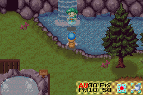
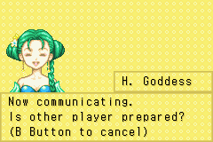
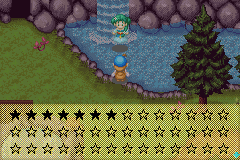
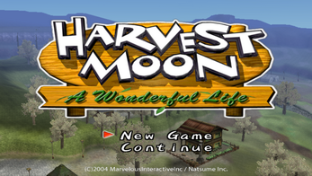
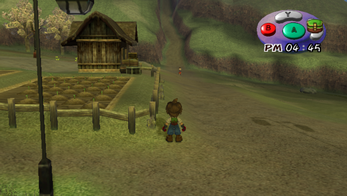
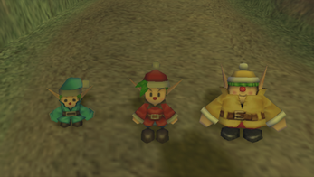
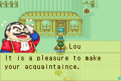

# 联机

- 矿石镇可以与 GC 的《牧场物语 美丽人生》进行联机。
- 实体机需要一条 GC-GBA 传输线。
- 模拟器则需要 VBALINK 和 Dolphin 这两个模拟器

## 具体步骤

### 等待联机状态

### 黑色的就是这次得到的星数

### 旁边那条小山路

### 遇到小精灵

### 遇到班

## 其他说明

联动完后矿石镇的图书馆二楼书架 可以查到有关 GC 人物的简介(端视 GC 存档玩的状况) 镇民偶尔也会聊到有关消息

虽然记录资讯,但同一个 GC 存档可以重复连动没问题

海的别墅是最好拿的一个了…不论实机或模拟器

只不过过程很无聊
