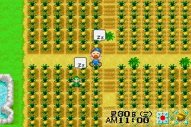
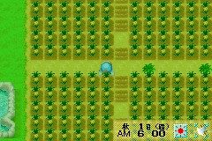
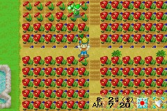

# 换季 BUG

在牧场物语男孩版(女孩版没试过，不知道行不行)里夏季最后一天不睡觉，秋一日 5:50-6:00 时会强迫睡觉，

而我们只需增加疲劳度至马上就晕倒的程度，这样在换天时就会晕倒进医院

等醒来时(秋二日)，就会惊奇的发现农场里的作物会变得很奇怪

(如图 3)但对那个位置点一下，发现手里多了个菠萝，其实现在夏季的作物就可以继续生长了，

小矮人可以浇水和收获，现在就变成了可以每 5 天收一次菠萝了。

而此 BUG 不会影响原有秋季规律，如地瓜可以直接种植，后山还是可以拿到秋季特产。

这样的话两季就可以净赚 392W，比原来的 231W 多了 160 多 W.而且秋季也会相对轻松很多。

把牧场分为 4 大块，每块为 21×12 格。（这样分配应该是对这个牧场的最大利用了）。

**两季菠萝收 8 次**：21×12×4×8×500-112×1000= 3,920,000(G)

而不用 BUG 最大利润：

**菠萝**：21×12×4×2×500-112×1000= 896000(G)

**地瓜**：21×12×4×12×120-112×300= 1417920(G)，相加才 231W。

其实秋季换冬季也可以用此 BUG 的，但地里看起来很不舒服，所以不是很推荐在冬天继续种，

当然小矮人还是可以在这样的土地浇水收获的。

除非你想买别墅（用此 BUG 一年最多可 1200W，几年就可以买到别墅），

要不就不要在秋换冬用这 BUG.继续用下去的话春季植物会变隐形的，呵呵。

用了 BUG 后过时的作物就显示不正常了，目前还没有解决办法。

如果不想要的话就直接割掉就可以了，种上当季作物和平时一样的（不割也不会影响其他作物）。

我用这个 BUG 主要是在秋季有菠萝收，赚钱比地瓜多，而且五天收一回，相对地瓜来说轻松很多。

还有，只有秋-冬换季用了 BUG 就算把作物割掉地面还是会不正常的。

PS：有些玩家比较喜欢种牧草放牧。

其实秋季把牧草种下去的话冬季还是可以继续生长的，只须在正确位置挥动镰刀就可以收获。

不过还是不建议冬天割草——因为冬天也可以放牧！只是看不到牧草而已。

上面说得话不需要用这个 BUG，但是到了春天那里就变成了刚种上种子的样子，这 BUG 就又有用处了。

冬换春时用了它你会发现牧草已经长好了(当然需要你再冬天最后 10 天没有收割这些牧草)。

那样你就可以很快的圈地放牧了，不用每天把牛羊赶出来再赶进去。

注意：因在 1 号早上晕倒，所以要在 2 号才能起床，动植物需提前拜托小矮人浇水，收获，喂食。

**镇长注**：经黑暗 BASS 等会员验证，英文版和女孩版同样适用此 BUG。

另外强调关键词：6 点、自动

因为 6 点被瞬移回家男孩版会加 4 点疲劳，女孩版加 10 点，就要在这几点疲劳里面自动晕倒，所以你过了 4 点让主角脸色发青再用几下就差不多了
