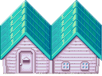
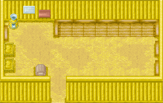

# 鸡小屋

用来养鸡，可以增筑。

## 介绍

用来养殖鸡。

一开始可以养殖 4 只，增筑后最多可以养殖 8 只。

可以通过「塞巴拉的锻冶屋」购置「蛋黄酱加工机」

可以通过往「孵化箱」放置鸡蛋来孵育新的小鸡。

在鸡小屋左侧，有水车小屋，可以将玉米加工成鸡饲料。

**1 份玉米可以加工 20 份鸡饲料**，很划算呦！

## 增筑

增筑需要：

1. 5000 G
2. 420 块木材
