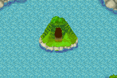
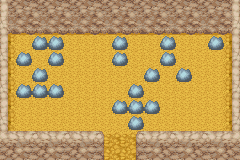

# 湖心矿石场

大部分时间这个矿石场都被湖水包围着，但到了冬季湖水结冰后就可以进去了。

里面可以挖到一些泉之矿石场所挖不到的东西。

有兴趣的话还可以丢根黄瓜到湖里看看。

## 矿场产物

- 岩石中

| 名称       | 价格   | 作用                   | 层数                                                                                                                                                              |
| ---------- | ------ | ---------------------- | ----------------------------------------------------------------------------------------------------------------------------------------------------------------- |
| 废矿石     | 1g     | -                      | 所有层数                                                                                                                                                          |
| 月亮石     | 55g    | -                      | 地下个位数是 8 的层数及地下 255                                                                                                                                   |
| 沙漠玫瑰石 | 60g    | -                      | 地下个位数是 9 的层数及地下 255                                                                                                                                   |
| 粉红钻石   | 10000g | -                      | 地下 30 层 地下 70 层 地下 90 层 地下 110 层 地下 130 层 地下 170 层 地下 190 层 地下 210 层 地下 220 层 地下 230 层 地下 240 层 地下 250 ～ 255 层 每层只有 3 个 |
| 亚历山大石 | 10000g | -                      | 地下 50 层 地下 100 层 地下 150 层 地下 200 层 地下 210 层 地下 230 层 地下 240 层 地下 250 ～ 255 层 每层只有 3 个                                               |
| 钻石       | 100g   | -                      | 地下 10 层 地下 20 层 地下 30 层 地下 70 层 地下 90 层 地下 110 层 地下 130 层 地下 170 层 地下 190 层 地下 201 ～ 255 层                                         |
| 祖母绿     | 80g    | -                      | 个位数是 5 的层数 及地下 40 层 地下 60 层 地下 80 层 地下 120 层 地下 140 层 地下 160 层 地下 180 层 地下 201 ～ 255 层                                           |
| 红宝石     | 75g    | -                      | 地下 50,100,150,200 以外的层数                                                                                                                                    |
| 黄玉       | 70g    | -                      | 地下 50,100,150,200 以外的层数                                                                                                                                    |
| 橄榄石     | 68g    | -                      | 地下 50,100,150,200 以外的层数                                                                                                                                    |
| 萤石       | 65g    | -                      | 地下 50,100,150,200 以外的层数                                                                                                                                    |
| 玛瑙       | 62g    | -                      | 地下 50,100,150,200 以外的层数                                                                                                                                    |
| 紫水晶     | 60g    | -                      | 地下 50 层 地下 100 层 地下 150 层 地下 200 层 以外的层数                                                                                                         |
| 河童之玉   | -      | 秘宝，总共有九个要收集 | 地上 1 层 地下 40 层 地下 60 层 地下 80 层 地下 120 层 地下 140 层 地下 160 层 地下 180 层 地下 255 层                                                            |

- 土中

| 名称       | 价格 | 作用                              | 层数       |
| ---------- | ---- | --------------------------------- | ---------- |
| 钱         | 随机 | -                                 | 所有层数   |
| 黑色草     | 10g  | 恢复少许体力和疲劳(体力+5 疲劳-5) | 所有层数   |
| 力量果实   | -    | 恢复体力较少疲劳增加主角体能上限  | 地下 19 层 |
| 诅咒的鱼杆 | -    | 农具                              | 地下 29 层 |
| 诅咒的锄头 | -    | 农具                              | 地下 39 层 |
| 诅咒的斧头 | -    | 农具                              | 地下 49 层 |
| 诅咒的锤子 | -    | 农具                              | 地下 59 层 |
| 诅咒的水壶 | -    | 农具                              | 地下 69 层 |
| 诅咒的镰刀 | -    | 农具                              | 地下 79 层 |
