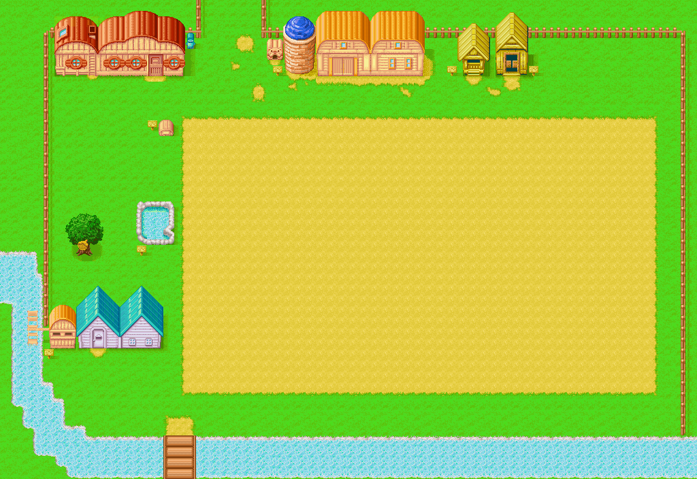

# 自己的牧场

- 男孩版：从老爷爷那里继承来的牧场
- 女孩版：看到坑爹广告以后，用所有积蓄买下的牧场

## 设施

| 设施                            | 介绍                                                                                |
| ------------------------------- | ----------------------------------------------------------------------------------- |
| [自家](../place/home)           | 主人公居住的地方，可以通过[增筑](./place/expansion)变大。                           |
| 信箱                            | 有时候会收到一些信。                                                                |
| 狗窝                            | 然而狗并不住在狗窝里……                                                              |
| 耕地                            | 用来种植农作物                                                                      |
| 池塘                            | 可以给喷水壶汲水 女孩版，池塘中可以养鱼                                             |
| 出荷箱                          | 用于出售收获的农副产品等。                                                          |
| 苹果树                          | 牧场里有苹果树每日都会产一个蜂蜜。秋季还有苹果可以收获。                            |
| [动物小屋](../place/animal-hut) | 用来养牛和羊，可以[增筑](./place/expansion)                                         |
| [马小屋](../place/horse-hut)    | 用来养马                                                                            |
| 木材放置处                      | 放置木材                                                                            |
| [鸡小屋](../place/chicken-hut)  | 用来养鸡，可以[增筑](./place/expansion)                                             |
| 水车小屋                        | 在鸡小屋左侧，可以将玉米加工成鸡饲料。 **1 份玉米可以加工 20 份鸡饲料**，很划算呦！ |

## 牧场地图

