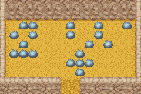

# 泉边矿石场

当你需要升级你的道具的时候就需要到矿石场采集所需的矿石了喔。

运气好的话也许能挖到什么好东西也说不定。

## 矿场产物

- 岩石中

| 名称     | 价格   | 作用                                     | 层数                                                                                                                          |
| -------- | ------ | ---------------------------------------- | ----------------------------------------------------------------------------------------------------------------------------- |
| 废矿石   | 1g     | -                                        | 所有层数                                                                                                                      |
| 铜       | 15g    | 工具 100%经验 升级用                     | 所有层数                                                                                                                      |
| 银       | 20g    | 工具 200%经验 升级用                     | 所有层数                                                                                                                      |
| 金       | 25g    | 工具 300%经验 升级用                     | 地下 3 层以下                                                                                                                 |
| 秘银     | 40g    | 工具 400%经验 升级用                     | 地下 5 层以下                                                                                                                 |
| 奥里哈钢 | 50g    | 制作项链、耳环、手镯、胸针               | 地下 9 层以下                                                                                                                 |
| 金刚石   | 50g    | 制作羊毛加工机、奶酪加工机、蛋黄酱加工机 | 地下 9 层以下                                                                                                                 |
| 贤者之石 | 20000g | 工具 升级用                              | 地下 60 层 地下 102 层 地下 123 层 地下 152 层 地下 155 层 地下 171 层 地下 190 层 地下 202 层 地下 222 层 地下 231 ～ 255 层 |
| 女神之玉 | -      | 秘宝，总共有九个要收集                   | 地下 60 层 地下 102 层 地下 123 层 地下 152 层 地下 155 层 地下 171 层 地下 190 层 地下 202 层 地下 222 层                    |
| 飞行石   | -      | 可以瞬间飞到地图相应的位置               | 地下 255 经营牧场 3 年以后                                                                                                    |

- 土中

| 名称     | 价格 | 作用                              | 层数                                     |
| -------- | ---- | --------------------------------- | ---------------------------------------- |
| 钱       | 随机 | -                                 | 所有层数                                 |
| 黑色草   | 10g  | 恢复少许体力和疲劳(体力+5 疲劳-5) | 地上 1 层 地下 1 ～ 100 层 250 ～ 255 层 |
| 力量果实 | -    | 恢复体力较少疲劳增加主角体能上限  | 地下 100 层                              |
| 迷之石板 | -    | 介绍料理的做法                    | 地下 255 层                              |
