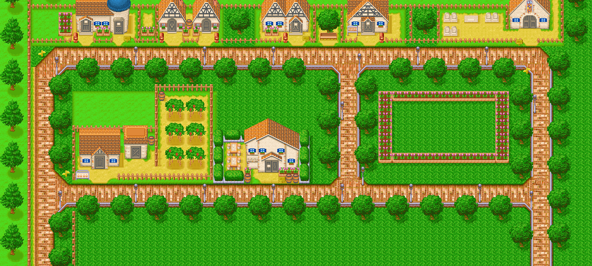
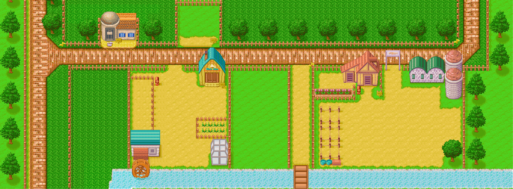

# 矿石镇

- [塞巴拉的锻冶屋](../place/forging)
- [养鸡场](../place/chicken-farm)
- [尤德尔牧场](../place/yudel)
- [村之别墅](../place/village-villa)

- [医院](../place/hospital)
- [杂货屋](../place/grocery-house)
- [教堂](../place/church)
- [小矮人的家](../place/elf)

- [巴基尔的家](../place/barkell)
- [玛丽的图书馆](../place/library)
- [艾莲的家](../place/ai-lian)
- [镇长的家](../place/mayor)

- [果树园](../place/orchard)
- [宿屋](../place/hostel)
- [玫瑰广场](../place/square)

