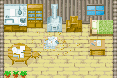
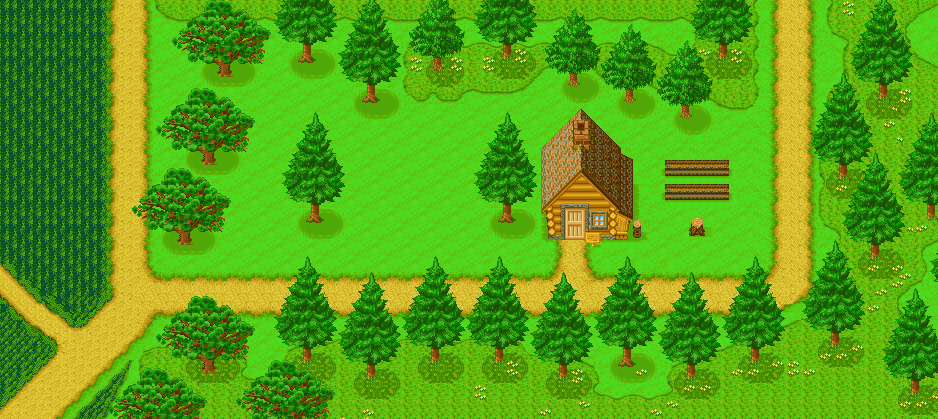

# 樵夫的家

哥茨在你的牧场后面的森林中居住着。

他能帮你增建你的住宅和饲养动物的小屋。

还可以从他这里买到木材。

## 营业时间

- 时间:AM11:00 ～ PM4:00
- 定休日:土曜日

## 价格

| 商品          | 价格       | 木材   |
| ------------- | ---------- | ------ |
| 自宅增筑 1 次 | 3000G      | 300 块 |
| 自宅增筑 2 次 | 10000G     | 700 块 |
| 鸡屋增筑      | 5000G      | 420 块 |
| 牛羊屋增筑    | 6800G      | 500 块 |
| 窗的改建      | 25000G     | 300 块 |
| 狗屋改建      | 20000G     | 500 块 |
| 信箱改建      | 10000G     | 200 块 |
| 别墅          | 100000000G | 999 块 |

## 全景

