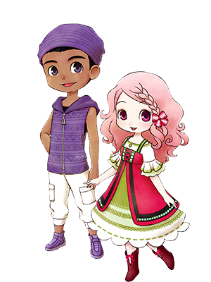
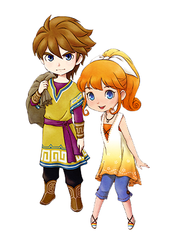
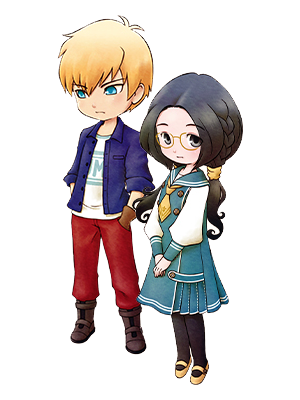
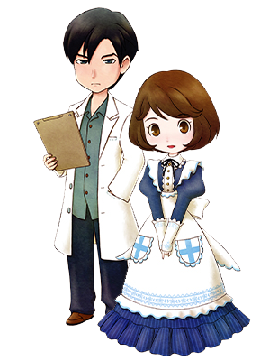

# 情敌事件

主人公与任何人都没有结婚和没有婚约，并与特定人物的好感度低的情况下发生。  
结婚候补真正在意的对象是？

## 里克与卡莲

熟知彼此的青梅竹马，  
第一阶段是两人谈论旅行未归的里克的父亲，  
第二阶段是互相描述儿时的回忆。

### 事件发生条件

- **第一阶段**
  - **地点：** 泉
  - **条件：** 与里克&卡莲的好感度未满 10000
  - **星期：** 三～六
  - **天气：** 晴
  - **时间：** AM11:00 ～ PM6:00
- **第二阶段**
  - **地点：** 伐木之家附近
  - **条件：** 与里克&卡莲的好感度未满 30000
  - **星期：** 一、日
  - **天气：** 晴
  - **时间：** AM11:00 ～ PM6:00

## 凯与珀布莉

好奇心旺盛的珀布莉对凯积极的展开进攻，  
第一阶段是凯提议去珀布莉家制作料理，  
第二阶段是担心珀布莉的里克对凯的愤怒。

### 事件发生条件

- **第一阶段**
  - **地点：** 海边
  - **条件：** 与凯&珀布莉的好感度未满 10000
  - **星期：** 日（夏季）
  - **天气：** 晴
  - **时间：** PM2:00 ～ PM4:00
- **第二阶段**
  - **地点：** 海边
  - **条件：** 与凯&珀布莉的好感度未满 30000
  - **星期：** 三、四、六（夏季）
  - **天气：** 晴
  - **时间：** AM9:00 ～ PM7:00

## 克里夫与兰

性格相反的克里夫和兰，第一阶段是初次对话的两人，  
第二阶段是兰照顾怕生的克里夫，渐渐缩短两人之间的距离。

### 事件发生条件

- **第一阶段**
  - **地点：** 旅馆 2 楼
  - **条件：** 与克里夫&兰的好感度未满 10000
  - **星期：** 一~五、日（夏季以外的 6 ～ 30 日）
  - **天气：** -
  - **时间：** PM7:00 ～ PM9:00
- **第二阶段**
  - **地点：** 教堂
  - **条件：** 与克里夫&兰的好感度未满 30000
  - **星期：** 一~五、日（秋季以外）
  - **天气：** -
  - **时间：** AM11:00 ～ PM4:00

## 格雷与玛丽

受伤的格雷受到了玛丽的治疗，被她的温柔所吸引了，  
第一阶段发生后格雷的日程表会发生变动，周一以外都在图书馆度过。

### 事件发生条件

- **第一阶段**
  - **地点：** 铁匠铺
  - **条件：** 与格雷&玛丽的好感度未满 10000
  - **星期：** 二~日
  - **天气：** -
  - **时间：** AM10:00 ～ PM1:00
- **第二阶段**
  - **地点：** 图书馆 1 楼
  - **条件：** 与格雷&玛丽的好感度未满 30000
  - **星期：** 二~日
  - **天气：** -
  - **时间：** PM1:50 ～ PM4:00
  

## 多特与艾丽

一同工作的工作伙伴，第一阶段是迟钝的多特感受不到艾丽的心情。  
第二阶段可见到检查艾丽的祖母时，多特表现出了作为医生的真诚态度。

### 事件发生条件

- **第一阶段**
  - **地点：** 医院 1 楼
  - **条件：** 与多特&艾丽的好感度未满 10000
  - **星期：** 一、四~日
  - **天气：** -
  - **时间：** AM9:00 ～ PM7:00
- **第二阶段**
  - **地点：** 爱莲家
  - **条件：** 与多特&艾丽的好感度未满 30000
  - **星期：** 一
  - **天气：** -
  - **时间：** AM9:00 ～ PM7:00

