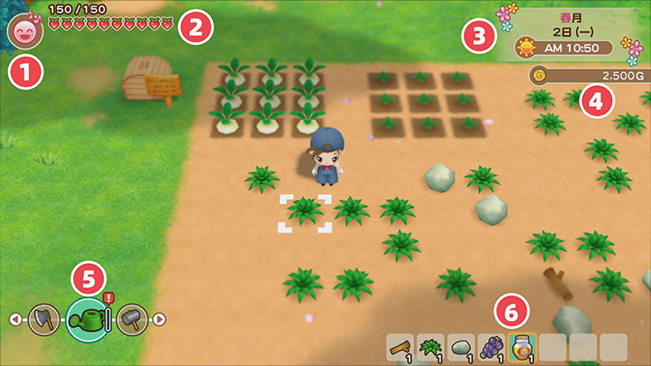
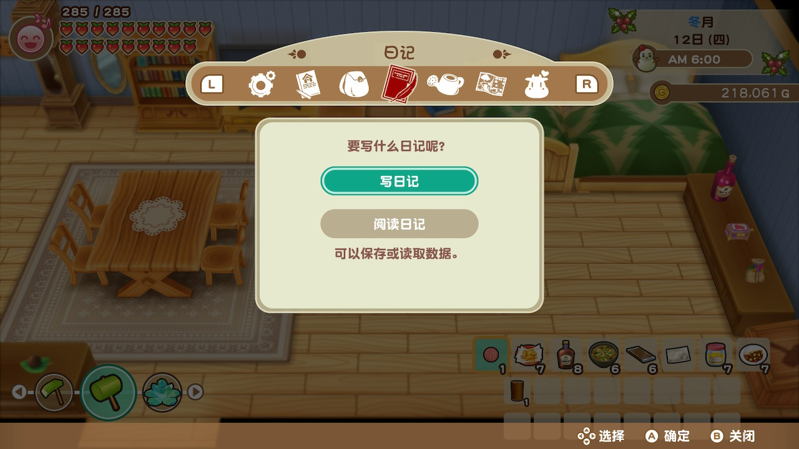

# 基础知识

游玩本游戏所必要的基础知识讲解。  
了解画面、物品与道具的使用方式、体力与疲劳度系统的构成。

- [游戏画面](#游戏画面)
- [道具与物品](#道具与物品的使用方法)
- [菜单](#菜单的使用方法)
- [体力与疲劳](#体力与疲劳度的回复)
  - [力量果实](#力量果实的获得方法)
  - [不可思议树之果实](#不可思议树之果实获得方法)
- [时间与日期](#时间与日期)
- [天气相关](#天气的种类与影响)

## 游戏画面

游戏画面会表示主人公的体力、疲劳度、当天天气与日期、游戏中时间、现金与持有物及道具等各种信息。

其中体力、疲劳度、时间流逝几项更是尤为重要，请牢记各个项目的功能。

### 画面内容

1. 主人公的疲劳度  
   PM10:00 之后或雨雪天气中，使用道具或采取某些动作便会积累疲劳。  
   图标随疲劳度阶段发生变化。
2. 主人公的体力  
   主要因使用道具减少。睡觉、泡温泉、使用回复物品都可回复体力。
3. 日期、天气、时间  
   显示当前日期、天气、游戏内时间。
4. 金钱  
   表示现在持有的金钱（G）。
5. 道具栏  
   显示背包中的道具。
6. 物品栏  
   显示背包中的物品。

## 道具与物品的使用方法

**注：本攻略中介绍的游戏操作基于 Nintendo Switch 版《牧场物语 重聚矿石镇》。  
其他版本请以实际游戏为准。**

道具用选择，按使用。

物品用选择举起，使用效果随按键而变化。

包中持有道具及物品后才能使用，所以将要使用的东西装入背包吧。

### 道具的使用方式

按左右键将要使用的道具选定至中间，按使用。

道具按照菜单中「道具」的顺序切换。

### 物品的使用方式

物品举起后方可使用

- 可以放置或丢弃的情况下，按放下
- 按食用食物
- 按将举起的物品放回背包

## 菜单的使用方法

本作每天起床时会自动存档，也可以使用菜单中「日记」及家中的日记本来任意存读档。

菜单中「日记」在发生特殊事件等情形下不可使用，其他情况下都可自由调用。

游戏中按可随时调出菜单。

按 或 键切换菜单项目。

### 菜单一览

- 日记  
  「写日记」可存档，「阅读日记」可读档，共有 8 个存档位置。
- 道具

  显示当前持有的道具。可按或交换顺序，按确认改造情况。

- 持有物  
  显示当前持有的物品。可在此交换排列顺序、食用或丢弃物品。
- 地图

  显示全体地图及牧场地图。全体地图中可移动光标，按查看各个设施情报。

- 牧场资讯  
  显示当前游戏状况。可确认主人公的称号、饲育的动物数量等情报。
- 交流资讯  
  可显示已经认识的居民、小精灵、动物、宠物的各项情报。
- 设定  
  可进行 BGM 及音效音量、预设按键等多项设定。  
   （日版的游戏中还可以设置是否显示注音）

### 持有物的操作

1 格最多可收纳 9 个同种物品。

可在菜单中的「持有物」中进行分批、食用、丢弃等操作。

如果背包全满则不能获得新物品，用上述操作腾出空位吧。

- **按移动（1 个）**

  包中有空格时，选择持有多个的物品按，即可将其逐个移动至空格。同一物品不能被分配至 3 格以上。

- **按移动、合并**

  按选定物品，选框会变蓝。此时选择空格按，物品会被移动。选择其他物品按，则与该物品交换。

- **按食用**

  选择可食用物品按，选择想食用的个数后按，即可食用。

- **按丢弃**

  选择想丢弃的物品按，选择想丢弃的个数后按。被丢弃的物品将永远消失。

## 体力与疲劳度的回复

体力会随着使用道具、采矿场中掉入陷阱而减少。

体力为 0 仍可继续行动，但会积累疲劳度。

疲劳度会以各种方式积累，当疲劳度达到最大值，当天便不能再活动。

在体力不支倒地前回复体力吧。

### 体力与疲劳度的主要回复方法

- 睡觉  
  「体力」回复 50 点+睡眠时间 × 每小时 7 点  
  「疲劳度」回复 5 点+睡眠时间 × 每小时 2 点
- 吃东西  
  回复量因物品而异
- 泡温泉  
  每分钟回复体力与疲劳度各 1 点
- 在旅馆吃饭  
  回复量因食物而异
- 装备女神的秘宝  
  每分钟回复 1 点体力
- 装备河童的秘宝  
  每分钟回复 1 点疲劳度
- 放入柴火到壁炉  
  仅冬天有效，其他季节反而会增加疲劳度
- 在花瓶中装饰花朵  
  有些花不会回复体力、无法消除疲劳

### 会积累疲劳度的行动

- 雨雪天气在室外使用道具：每次使用+1
- PM 10:00 - PM 11:59 使用道具：每次使用+1
- AM 0:00 - AM 5:59 使用道具：每次使用+2
- AM 0:00 时：+3
- AM 2:00 时：+4
- AM 4:00 时：+4
- 熬夜到 AM6:00 没睡：+10
- 体力为 0 时使用道具：+2
- 使用诅咒道具：+10
- 放入柴火到壁炉：除冬天外，其他季节会增加疲劳度

疲劳度：0

疲劳度：1~48

疲劳度：50~79

疲劳度：80~100

### 用「力量果实」及「不可思议树之果实」强化

「力量果实」共 10 个。

「力量果实」可以使体力上限增加 1 格（15 点）。

「不可思议树之果实」可以使疲劳度的增长速度减半。

使主人公在疲劳后，可以行动更长时间，请尽早获取。

※ 获得「力量果实」与「不可思议树之果实」后，主人公会当场吃掉，立刻生效。

#### 「力量果实」的获得方法

- 耕地时有 1.2%几率出现
- 向女神献上供品 10 次（将物品扔进女神之泉即可）
- 春季或秋季赛马获胜
- 春季或秋季赛马以 900 赛马券换取
- 在「湖之采矿场」背侧拾取
- 在「泉之采矿场」地下 100 层锄地，有 19.5%概率出现
- 在「湖之采矿场」地下 19 层锄地，有 19.5%概率出现
- 在杂货店花费 10,000G 购买
- 在海边召开的「飞盘大赛」上获胜
- 冬天时，在海边用钓竿蓄力 5 级钓起

#### 「不可思议树之果实」获得方法

- 向河童献上供品 10 次（将黄瓜扔进湖中即可）

## 时间与日期

除打开菜单、在室内之外，游戏时间会一直推进。

主人公在 **AM6:00 ～ AM5:59** 期间可以活动，

第二天 AM6:00 日期会推进 1 天。

每个月共有 30 天，每年有春、夏、秋、冬 4 个月。

### 时间与日期的关系

AM6:00 ～ AM5:59 视为为 1 天。

AM12:00 时，日期会发生变化，但直到 AM5:59 均视为一天。

### 时间的影响

主人公 PM10:00 后行动会积累疲劳度。

除主人公外，矿石镇的居民也会遵循时间、星期、日期而生活。

居民所在地点、商店营业时间、特殊事件等都与星期及日期息息相关。

## 天气的种类与影响

天气分为晴、雨、台风、雪、大雪 5 种，每天变化。

各个天气的概率随季节变化而不同，台风仅在夏天发生，大雪仅在冬天发生。

电视会进行明天的天气预报。牢记天气的特点，根据天气预报而应对吧。

### 天气的概率与特点

| 天气 | 春  | 夏  | 秋  | 冬  |
| ---- | --- | --- | --- | --- |
| 晴天 | 70% | 82% | 80% | 50% |
| 雨天 | 30% | 10% | 20% | -   |
| 雪天 | -   | -   | -   | 42% |
| 台风 | -   | 8%  | -   | -   |
| 暴雪 | -   | -   | -   | 8%  |

 

<table>
    <thead>
        <tr>
            <th>天气</th>
            <th>特点</th>
        </tr>
    </thead>
    <tbody>
        <tr>
            <td>晴天</td>
            <td>没有什么特别的</td>
        </tr>
        <tr>
            <td>雨天</td>
            <td>作物无需浇水 动物不可放牧 使用道具的疲劳度上升量增加</td>
        </tr>
        <tr>
            <td>雪天</td>
            <td>使用道具的疲劳度上升量增加</td>
        </tr>
        <tr>
            <td>台风</td>
            <td rowspan="2">不能出家门 第二天牧场中可能散落树枝、岩石 部分作物可能消失不见</td>
        </tr>
        <tr>
            <td>暴雪</td>
        </tr>
    </tbody>
</table>

※ 节日当天一定是晴天。节日前一天因需事先准备，也必然是晴天。~~（因果律警告）~~
