# 游戏概要

整理介绍了本游戏的概要。  
一起浏览主要的游戏内容，主人公和难易度的设定和初回特典 DLC 吧！

## 矿石镇的牧场生活！

充满了小时候和爷爷一起的回忆的矿石镇，本作从主人公正式决定在这个城镇居住并继承爷爷留下的牧场开始的。

作为生活据点的矿石镇，主人公一边经营着牧场，一边和镇上的人们逐渐加深了交流。

寻找陪伴一生的另一半也是游戏主要目的的之一。一起体验充满乐趣的牧场生活吧！

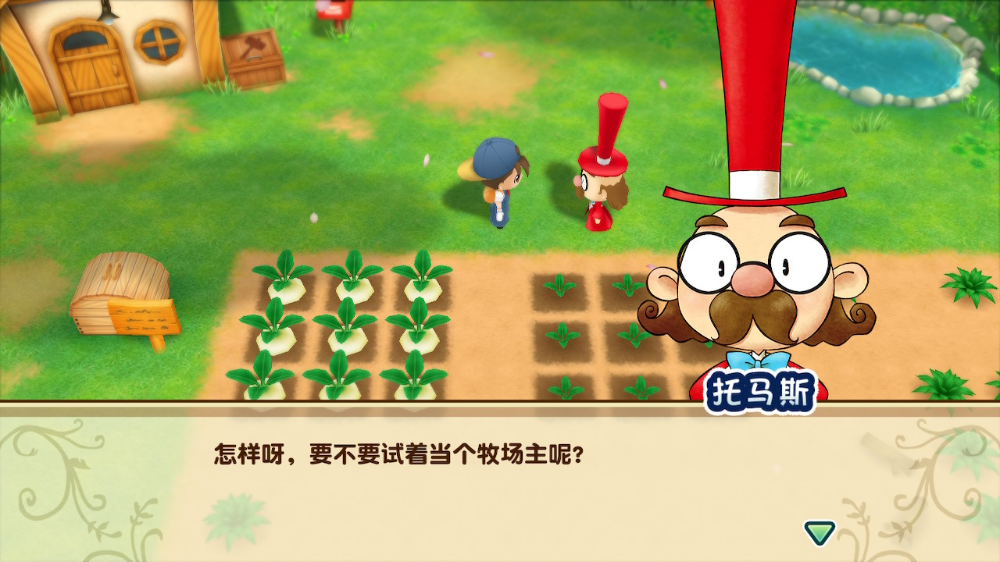

镇长托马斯先生正在向主人公介绍爷爷的牧场。从这里开始，新的生活开始了！

### 农作

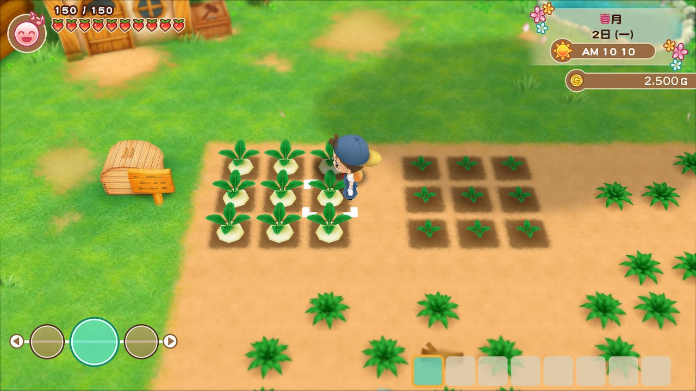

耕地、播种、浇水来培育作物。可以培养的作物会根据季节而变化。

培育出的作物可以出货来获得收入，也可以为礼物送给居民作或者作为料理的材料。

### 饲育

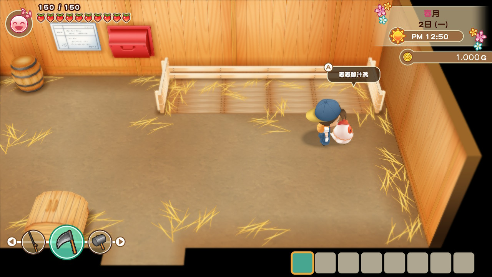

像农作物一样，牧场生活必不可少的动物饲育。

喂食、刷毛，每天的照料工作虽然非常辛苦，但会获得像是鸡蛋，牛奶这样充满魅力的农副产物。

### 挖掘

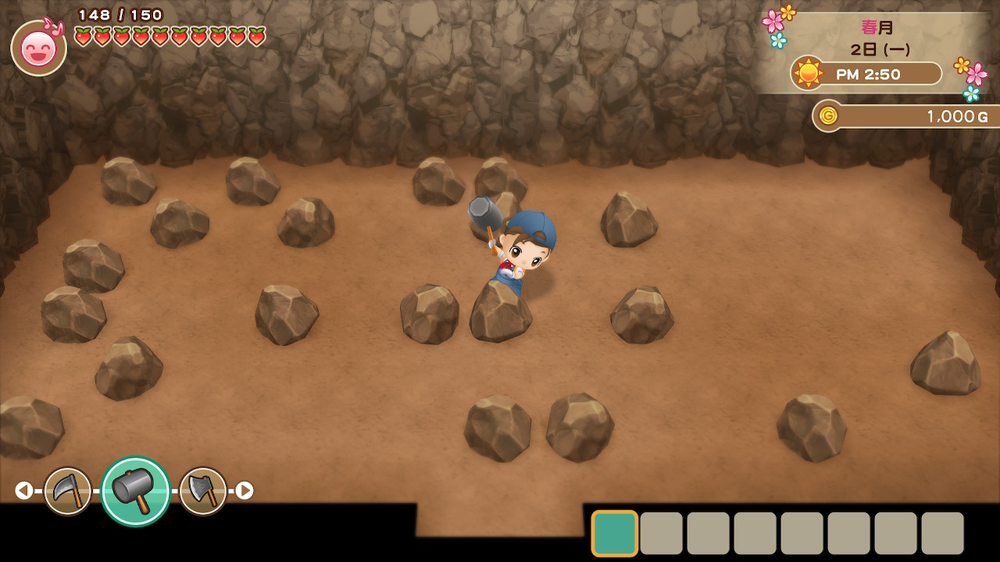

两个采矿场，可以采集到不同种类的矿石。矿石不但可以出货，还可以用来强化道具。

另外，采矿场中不但有矿石，还能挖掘到各种稀有的物品。

### 钓鱼

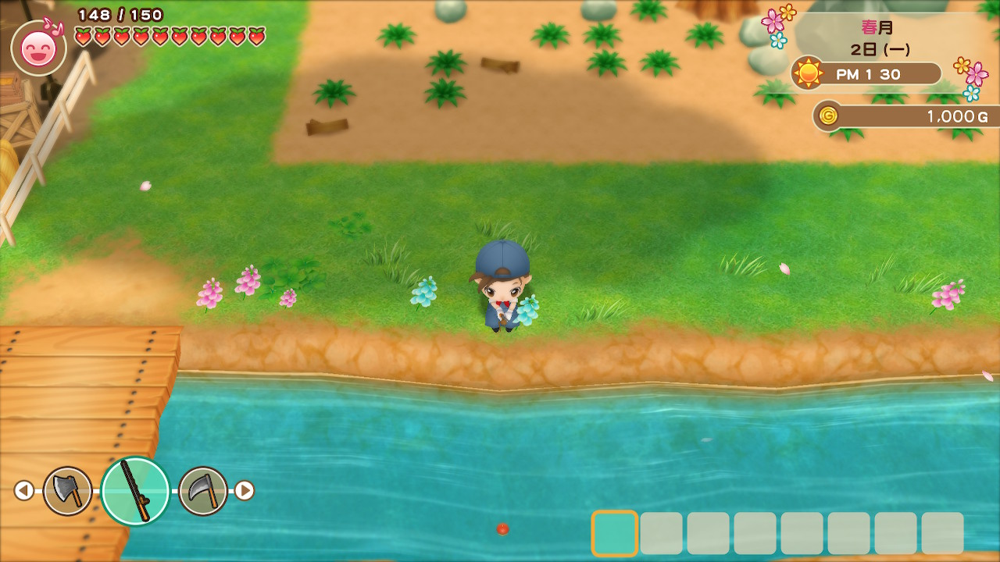

当「钓竿」获得之后，就可以在各种可以钓鱼的地方体验到钓鱼的乐趣。

鱼可以用来出货，也可以送给居民作为礼物。也可以把钓到每个钓鱼场所独立存在的鱼王作为目标。

### 料理

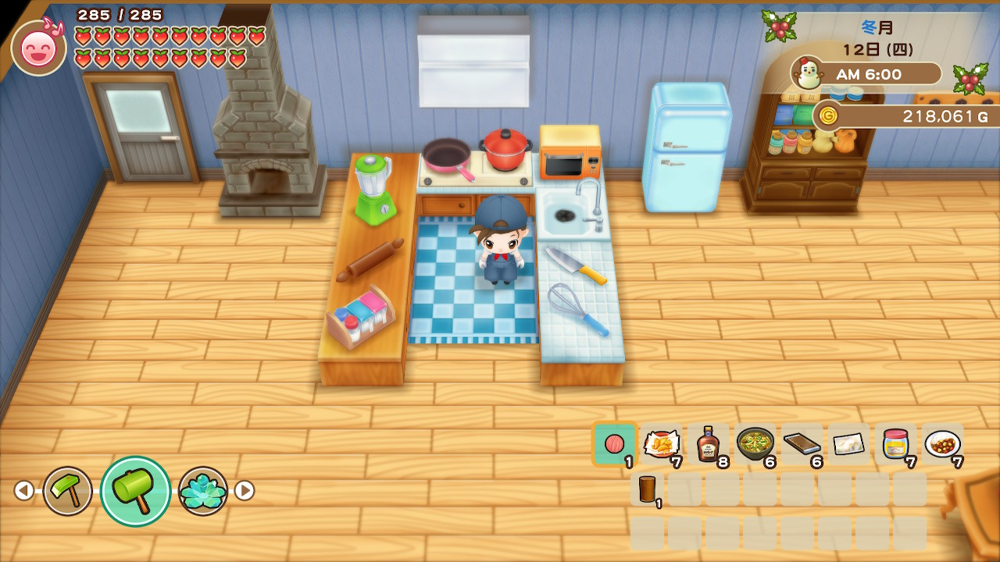

拥有了厨房、必要料理工具、食谱和原材料之后，就可以做料理了。

做好的料理可以当作礼物送给镇上的居民，自己食用还有回复体力的功效。

### 和村民交流

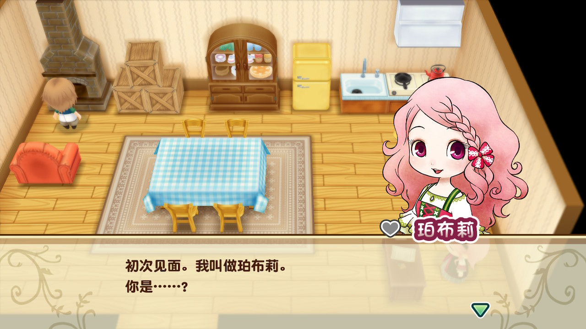

与居民对话，送礼可以增进与他们的感情交流。同时也会触发各种事件。

另外，镇上的各种节日也是交流的机会之一。

## 选择主人公的性别

打开游戏之后，首先进行主人公的外表和生日的设定。  
外表男女各有 2 种，每种还有 3 种肤色可以选择。

另外，生日按照游戏中的日历来设置，月份从春天到冬天，日期有 1 ～ 30 日可以选择。按照喜好来设定吧。

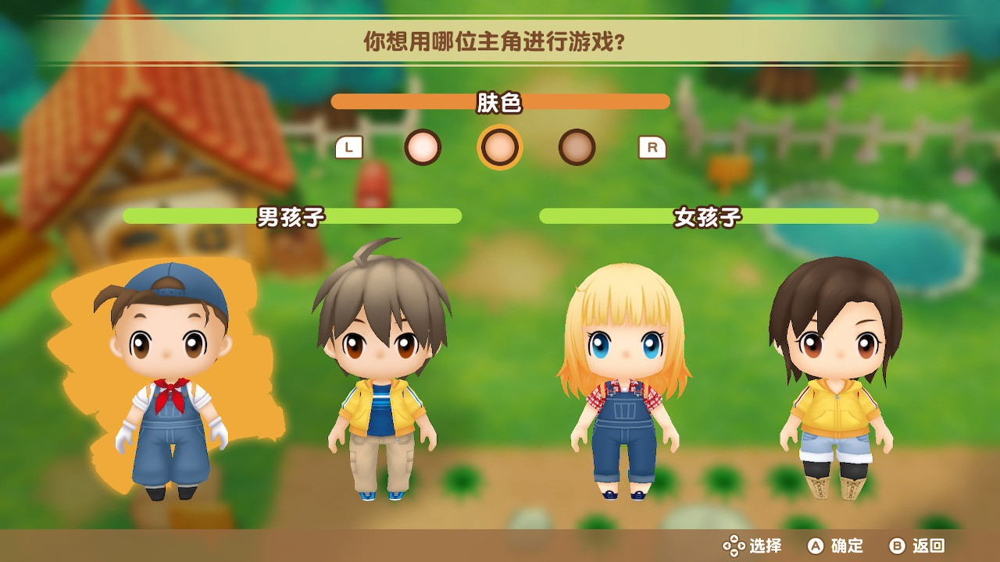

除了外表，其他的都没有差别，可以按照喜好选择。衣服可以在游戏过程中换装，不用过多考虑。

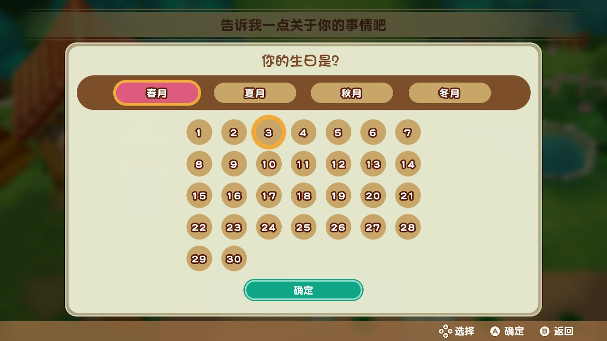

生日在 4 个月份 ×30 天中选择。主人公生日当天，会收到来自居民的祝福的信件。

## 选择难易度

在游戏开始时，设定主人公的同时还需要设定游戏难易度。难易度分为「普通模式」和「简单模式」两种。

「简单模式」中起始拥有的金钱较多，所有货物出货金额较高，是更加轻松的游戏的模式。

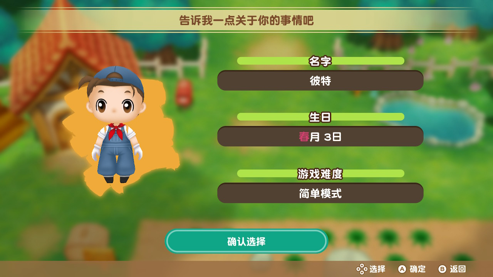

设置完生日之后，设置生日的下方选择难易度吧。

### 简单模式的特征

- 初始金钱 2500G
- 出货金额一直是 1.2 倍
- 居民亲密度提升的容易度 1.2 倍
- 最初开始耕地中种有结果的芜菁（3×3）和成长中的芜菁（3×3）

## 初回特典的 DLC 中追加的打扮

只要调查自家的镜子就可以变更主人公的服装。
拥有初回特典 DLC 的话，在可选的服装中，将会追加下面的玩偶装扮。

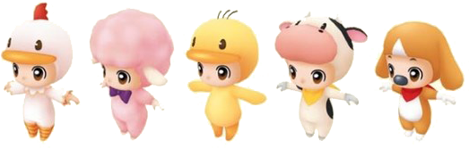

#### 各店铺的预售特典

- Amazon 鸡的布偶装
- GEO 羊的布偶装
- 楽天 books 小鸡的布偶装
- e-Shop 牛的布偶装
- Joshin 狗的布偶装

※ 港服 e-shop 也享有特典「牛的布偶装」，但港版（亚洲区）实体卡带无任何特典。  
※ 在 Steam、PS4、Xbox 等平台中，动物的布偶装以 DLC 的形式发售。
