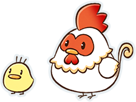
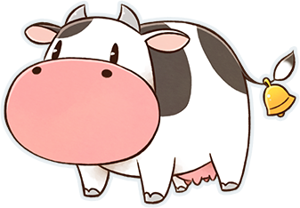
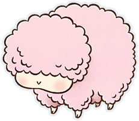
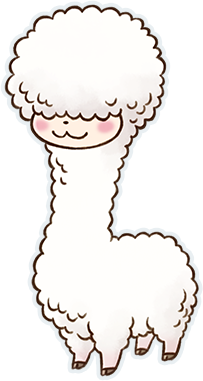
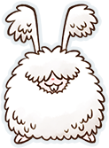

# 饲育动物

与农作一样，饲育动物也是牧场生活中非常重要的工作。

在矿石镇中，能够饲育的动物有 5 个种类。

牛有咖啡奶牛、草莓奶牛等 4 个种类的变种，副产品各不相同。

鸡有两个种类，颜色不同，但副产品相同。

不管是哪一种动物，最初的一只都要去「小鸡与莉莉娅」、「约德尔牧场」购买。

- [动物种类](#动物的种类)
- [贩卖店铺和饲育场所](#贩卖店铺和饲育场所)
- [取得副产品](#从动物身上取得的副产品)
- [照顾方法](#照顾动物的方法)
- [获取饲料](#获取动物们的饲料)
- [好感度](#动物的好感度)
- [繁殖](#动物的繁殖)
- [副产品加工](#副产品的加工)

## 动物的种类

- 鸡

  鸡、茶色鸡

- 牛

  牛、咖啡奶牛、草莓奶牛、水果奶牛

- 羊
- 羊驼
- 安哥拉兔

## 贩卖店铺和饲育场所

最初就购买价格最合适的鸡来尝试饲育吧！

| 动物     | 贩卖店铺     | 饲育场所 | 饲育数量（扩建前） | 饲育数量（扩建后） |
| -------- | ------------ | -------- | ------------------ | ------------------ |
| 鸡       | 小鸡与莉莉娅 | 鸡兔笼舍 | 4 只               | 8 只               |
| 安哥拉兔 |
| 牛       | 约德尔牧场   | 动物小屋 | 8 只               | 16 只              |
| 羊       |
| 羊驼     |

在动物小屋的照料使用穿透功能（按住跑步，可以不被卡位）会很便利。

动物小屋饲育的动物数量增多时可以灵活运用。

而且，在狭窄的小路与居民挤在一起时也可以用按穿过居民后继续前进。

## 从动物身上取得的副产品

可以从动物的身上采集到下表中的副产品，表中的采集频率是指每天都喂食的情况下。

安哥拉兔、羊、羊驼如果不喂食，则下一次可以采集的天数会增加。

另外，鸡以外的动物的副产品需要专门的工具采集。

| 动物       | 副产品     | 采集频率 | 必要的道具 |
| ---------- | ---------- | -------- | ---------- |
| 鸡、茶色鸡 | 蛋         | 每天     | 无         |
| 牛         | 牛奶       | 挤奶器   |
| 咖啡奶牛   | 咖啡牛奶   |
| 草莓奶牛   | 草莓牛奶   |
| 水果奶牛   | 水果牛奶   |
| 安哥拉兔   | 安哥拉兔毛 | 5 天     | 剃毛剪     |
| 羊         | 羊毛       | 7 天     |
| 羊驼       | 羊驼毛     |

## 照顾动物的方法

重聚矿石镇的**动物们是不会死亡的**，但是想要获得副产品，每天都需要给动物喂饲料。

说话、刷毛、放牧的话动物的好感度会提高，所以每天都这样做吧。

另外，为动物刷毛需要去铁匠铺购入「毛刷」。

### 基本的照顾

- 说话

  和饲育中的动物一只只地说话吧。

- 喂饲料

  想要取得副产品，喂饲料是必须的。

- 刷毛

  仅可以对牛、羊、羊驼进行的操作。

- 放牧

  节约饲料的同时还可以提升好感度。

### 喂饲料的 3 种方法

- 直接喂饲料

  手持饲料对着动物说话，可以提升好感度。

- 放到饲料放置处

  手持饲料放到饲料放置处，需要放置相应动物数量的饲料。

- 放牧 4 小时以上

  放牧出去的动物会在 PM8：00 回到小屋，尽早地摇铃吧。

  放牧可以在晴天或是下雪的日子进行，摇动小屋前面的铃铛就可以了。

## 获取动物们的饲料

饲料有「鸡兔饲料」和「干草饲料」 两种，根据动物种类所需的饲料是不同的。

培养「玉米」、「牧草」来补充饲料更为实惠。

| 动物     | 所需饲料 | 获得方法                                                                         |
| -------- | -------- | -------------------------------------------------------------------------------- |
| 鸡       | 鸡兔饲料 | 在「小鸡与莉莉娅」购买（1 个 10G）向「水车磨坊」投入「玉米」（1 根可获得 30 份） |
| 安哥拉兔 |
| 牛       | 干草饲料 | 在「约德尔牧场」购买（1 个 20G）收割田地里的「牧草」（1 个牧草可获得 1 份）      |
| 羊       |
| 羊驼     |

#### 饲料可以储存在「水车磨坊」和「筒仓」

「鸡兔饲料」可以放入「鸡兔笼舍」的饲料放置处进行补充，想用「玉米」补充则需要投入「水车磨坊」。

另外，「干草饲料」可以放入饲料放置处、「筒仓」进行补充。

想取出饲料的时候对着饲料放置处按

想放入的时候则手持饲料对着饲料放置处按

「筒仓」与动物小屋的饲料放置处联动，可以在「筒仓」拿放饲料。

手持「玉米」投入「水车磨坊」，**1 个「玉米」可以补充 30 份饲料**。

#### 通过放牧节约鸡兔饲料

在通过放牧喂饲料的情况下，牛、羊、羊驼需要田地中长有足够数量的「牧草」。

但是，鸡和安哥拉兔不需要任何东西，只要每天放牧 4 小时以上就可以不需要喂饲料。

不过下雨的日子无法放牧，还是需要储备一些饲料的。

## 动物的好感度

动物的好感度会影响产出的副产品的品质。

好感度的数值可以通过每天的照料稍微提升。

数值每上升 25 则增加 1 颗心升级至下一阶段。

牛、羊、羊驼一天最多+4。

鸡、安哥拉兔无法刷毛，所以一天最多+3。

### 提高动物好感度的方法

- 说话：+1
- 刷毛（牛、羊、羊驼）：+1
- 放牧 5 小时以上：+1
- 直接喂饲料：+1

### 好感度与数值对应

| 好感度 |     | 数值对应 |
| ------ | --- | -------- |
|        | 0   | 0~24     |
|        | 1   | 25~49    |
|        | 2   | 50~74    |
|        | 3   | 75~99    |
|        | 4   | 100~124  |
|        | 5   | 125~149  |
|        | 6   | 150~174  |
|        | 7   | 175~199  |
|        | 8   | 200~224  |
|        | 9   | 225~249  |
|        | 10  | 250+     |

### 副产品的品质升级

动物的副产品可以从 S 上升直到变成 X。

动物的好感度决定了能取获得的产物。

想获得 G 以上的品质，除了好感度以外还需要在斗鸡节、评牛节、软绵绵节的活动上获胜。

#### 各品质的取得条件

| 品质 | 好感度 | 特殊条件                                       |
| ---- | ------ | ---------------------------------------------- |
| S    | 0-3    | -                                              |
| M    | 4-7    | -                                              |
| L    | 8-10   | -                                              |
| G    | 8-10   | 该动物在相应节日获胜                           |
| P    | 8-10   | 该动物在相应节日获胜放牧时间合计 1000 小时以上 |
| X    | 8-10   | 在能够取得 P 品质的产物后有 0.4%的概率取得     |

※ 鸡蛋：S=普通品质的蛋、M=高品质的蛋、L=优良品质的蛋、G=金蛋、P=白金蛋

### 检查「关系状况」中动物的状态

动物的好感度可以在菜单「关系状况」中查看。

「动物」界面中除了好感度外，还会标记当天是否进行过说话、刷毛、采集过副产品。

该动物在相应节日获胜的话，会显示王冠的标记。

## 动物的繁殖

可以在牧场中对动物进行繁殖。

鸡的繁殖只需将蛋放在孵化箱。

除此以外的动物需要使用「人工配种器」进行妊娠，经过一定天数后生下幼崽。

安哥拉兔、羊、羊驼在剪毛以后无法使用「人工配种器」。

想要繁殖安哥拉兔需要扩建「鸡兔笼舍」。

### 繁殖方法

- 鸡蛋放入小屋内的孵化箱，没有品质上的差异，即使不是当天产下的蛋也没关系。
- 鸡以外的动物 在「小鸡与莉莉娅」、「约德尔牧场」购入与动物相符的「人工配种器」，按使用。

### 喂食饲料的注意事项

孕期的动物无法放牧。

直接喂饲料或放置于孕期饲料箱。

| 动物     | 妊娠天数 |       |
| -------- | -------- | ----- |
| 喂饲料   | 不喂饲料 |
| 鸡       | 3 天     | 3 天  |
| 安哥拉兔 | 5 天     | 10 天 |
| 牛       | 21 天    | 30 天 |
| 咖啡奶牛 |
| 草莓奶牛 |
| 水果奶牛 |
| 羊       | 21 天    | 30 天 |
| 羊驼     | 21 天    | 30 天 |

### 经过一定天数后成年

生下的幼崽在经过一定天数后会长大成年。

副产品只能从成年的动物身上取得，所以每天好好照料等待成年吧。

是否喂食不会影响小鸡成长所需日数的长短，直接喂饲料的话好感度会升高。

另外，因为在「约德尔牧场」购入的牛是中型牛，所以想要取得副产品最短也需要经过 9 天。

### 动物的成长天数

| 动物             | 成长天数 |       |
| ---------------- | -------- | ----- |
| 喂饲料           | 不喂饲料 |
| 鸡               | 7 天     | 7 天  |
| 安哥拉兔         | 10 天    | 15 天 |
| 小牛 -> 中型牛   | 14 天    | 20 天 |
| 中型牛 -> 成年牛 | 9 天     | 14 天 |
| 羊               | 14 天    | 20 天 |
| 羊驼             | 14 天    | 20 天 |

※ 喂饲料指每天都喂饲料，不喂饲料指一次都没有喂过。

※ 小牛会先成长为中型牛（不可产奶），再长大成为成年牛（可产奶）

### 次世代增加好感度的上限

经过繁殖出生的幼崽最初的好感度即为 3 颗心，特征是好感度的上限增加 1 颗心。

因此，在幼崽成年后重复繁殖的流程，最高可以提高好感度至 10 颗心。

并且，小鸡的好感度上限是在好感度上限最高的成年鸡的上限基础上增加 1 颗心。

如果在没有养鸡或者只有小鸡的情况下孵蛋，孵出的小鸡好感度为 6 颗心。（基础 5 颗心+1）

### 诞生的幼崽的特征

最初的好感度即为 3 颗心。

在母亲的好感度上限基础上增加 1 颗心。

第 6 世代的动物幼崽，好感度上限可以达到最高的 10 颗心。

## 副产品的加工

在「赛巴拉铁匠铺」那里获得加工机后，可以对副产品进行加工。

不同加工机所加工出的副产品不同，所以购入想要获得的加工品对应的加工机吧。

加工机的使用方法是手持副产品，投入对应的加工机。

并且在加工品中，黄油是唯一不能出售的，作为料理的材料或送给居民的礼物来使用吧。

| 加工机       | 效果                                   |
| ------------ | -------------------------------------- |
| 蛋黄酱加工机 | 将鸡蛋加工成蛋黄酱                     |
| 芝士加工机   | 将牛奶加工成芝士                       |
| 黄油加工机   | 将牛奶加工成黄油                       |
| 毛线团加工机 | 将安哥拉兔毛、羊毛、羊驼毛加工成毛线团 |

**※ 请注意黄油无法出售**

### 加工机的获得步骤

1. 「泉之采矿场」的地下 10 层以后，用锤子破坏石头有一定几率出现「精金」。
2. 委托「赛巴拉铁匠铺」准备「精金」和钱，委托赛巴拉进行加工
3. 经过 5 天后，订购的加工机会设置在牧场的设施内。

### 副产品的售价变化

鸡蛋加工为「蛋黄酱」、牛奶加工为「芝士」时，无论品质如何都能提高售价。

另一方面，「安哥拉兔毛」、「羊毛」、「羊驼毛」会加工出对应品质的「毛线团」，售价也相同。

要记住，品质为 G 以上的「羊毛」和「羊驼毛」不加工直接出售所获得的的钱反而更多。

「芝士」只能通过加工牛奶获得，意外的贵重。

「安哥拉兔毛」无论什么品质，加工成「毛线团」后售价都会提高。

### 副产品加工品的售价

| 品质 | 蛋  | 蛋黄酱 | 牛奶 | 牛奶※ | 芝士 |
| ---- | --- | ------ | ---- | ----- | ---- |
| S    | 50  | 100    | 100  | 120   | 250  |
| M    | 80  | 150    | 220  | 240   | 380  |
| L    | 150 | 230    | 360  | 400   | 540  |
| G    | 200 | 300    | 500  | 550   | 700  |
| P    | 240 | 450    | 600  | 660   | 820  |
| X    | 350 | 800    | 800  | 900   | 1500 |

| 品质 | 安哥拉兔毛 | 羊毛 | 羊驼毛 | 毛线团 |
| ---- | ---------- | ---- | ------ | ------ |
| S    | 240        | 400  | 420    | 530    |
| M    | 400        | 700  | 740    | 920    |
| L    | 720        | 1300 | 1360   | 1400   |
| G    | 1000       | 2500 | 2700   | 2000   |
| P    | 1500       | 3200 | 3500   | 2800   |
| X    | 1800       | 3600 | 4000   | 3200   |

※ 牛奶：咖啡牛奶、草莓牛奶、水果牛奶

### 饲育的动物在活动中出场

动物可以出场的活动有 3 种。

获胜能获得奖品，除此之外在斗鸡节、评牛节、软绵绵节获胜还能提高副产物的品质。

评牛节、软绵绵节在好感度 8 心以上时，能够获胜。

| 活动     | 对应的动物                       |
| -------- | -------------------------------- |
| 斗鸡节   | 鸡、茶色鸡                       |
| 评牛节   | 牛、咖啡乳牛、草莓乳牛、水果乳牛 |
| 软绵绵节 | 安哥拉兔、羊、羊驼               |
