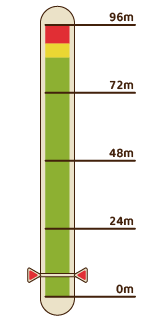

# 年度节日

矿石镇举办的活动是居民们重要的社交场所。  
记住基本的特征，和居民们逐渐加深交流吧

## 全年举办的活动

全年中，举办活动的节日有 18 种，节日的日期都是固定的。

大部分是在特定的场地举办，但也有像「春季感恩节」和「南瓜节」这样的，居民来自己的牧场拜访的活动。

想提高居民亲密度的话，就尽量参加活动，并和参加活动的居民说话吧。

另外，节日当天基本上全部的店和设施都会关门，前一天或者后一天是休息日的话，就会连续休息 2 天。

~~没有调休真好啊！~~

#### 节日时商店休息

镇上的商店和设施有固定的休息日，但节日时，除班先生的小店外，其他商店都会歇业。

即使节日从夜间开始，商店也会全天关门。如果需要商品，建议提前购买。

但是，春季感恩节、冬季感恩节、南瓜节等无固定召开场所的节日，商店仍然正常营业，可正常购物。

#### 活动的相同之处

- 能提高和来参加活动的居民的好感
- 能得到与节日内容及结果相对应的获胜奖品和道具
- 节日当天肯定是晴天。需要报名的话，前一天也会是晴天
- 居民的行程和平常有所不同，除商人班先生的小店之外全天关店

#### 节日一览

| 季节              | 日期                      | 名称                      |
| ----------------- | ------------------------- | ------------------------- |
| 春                | 1                         | [年糕大会](#年糕大会)     |
| 14                | [春季感恩节](#春季感恩节) |
| 18                | [春季赛马](#春季赛马)     |
| 22                | [美食节](#美食节)         |
| 夏                | 1                         | [入海节](#入海节)         |
| 7                 | [斗鸡节](#斗鸡节)         |
| 20                | [评牛节](#评牛节)         |
| 24                | [烟花大会](#烟花大会)     |
| 秋                | 3                         | [音乐节](#音乐节)         |
| 9                 | [收获节](#收获节)         |
| 13                | [赏月](#赏月)             |
| 18                | [秋季赛马](#秋季赛马)     |
| 21                | [软绵绵节](#软绵绵节)     |
| 30                | [南瓜节](#南瓜节)         |
| 冬                | 14                        | [冬季感恩节](#冬季感恩节) |
| 24                | [星夜祭](#星夜祭)         |
| 30                | [新年荞麦面](#新年荞麦面) |
| [跨年夜](#跨年夜) |

### 参加竞技性大赛的话，在前一天报名吧！

主人公能够参加「春季赛马」和「斗鸡节」之类的竞技性的节日活动。

想要参赛的话，活动前一天上午主办方来找自己时，选择「参赛」吧。

就算不参赛，只要活动当天按时去举办会场，也能够参加活动。

让动物或是宠物参赛的时候，从报名到活动结束为止，会暂时离开牧场由主办方照顾。

※ 活动前一天的早上，走出家门主办方就会出现邀请你参赛。但如果用「飞行石」出门就会错过。

※ 选择让动物参赛的话，那一天就不能照顾它了。

### 结束时间之前进入就能够参加

在特定会场举办的活动，只要在举办时间内进入会场，就能参加这个活动。

活动结束以后可以自由行动的时间，就是活动结束的时间。

PM 6:00 结束的场合，直接在自己家恢复自由活动。

PM 9:00 以后结束的节日，回家后会直接睡觉，直到第二天的 AM6:00 起床。

※ 直至活动结束前的 1 分钟，都可以进入会场参加，所以有效的利用时间吧！

※ 只要进入了会场，直到活动结束为止都无法出去。

### 提高与全部的参与者亲密度的机会

在节日时，可以提高和居民的亲密度和好感度。

在会场举办的活动的话，和参加活动的居民说话可以提高亲密度。

主人公参赛并获胜的话，亲密度会再次上升。

居民访问牧场的活动的话，给予对方对应的礼物，就能大幅度提高亲密度和好感度。

※ 和参加活动的居民说话，除了平常的说话的+1 亲密度之外，还会多提升一些亲密度。

### 获胜奖品和特产

主人公能够参赛的活动获胜后能够得到奖品。

像「年糕大会」和「新年荞麦面」那样的只要参加就能获得特产的活动，

还是尽量参加一下比较好。

- **春季赛马 / 秋季赛马**：力量果实
- **入海节**：力量果实
- **斗鸡节**：斗鸡节冠军奖杯
- **评牛节**：评牛节冠军奖杯
- **软绵绵节**：软绵绵节冠军奖杯
- **新年荞麦面**：荞麦粉

---

## 节日事件

### 【春 1 日】年糕大会

- **天气**：晴
- **时间**：PM6:00 ～ AM12:00
- **场所**：广场
- **备注**：

  第二年春开始可参加

  与托马斯对话选择「开始」

- **登场人物**：

  托马斯、兰、赛巴拉、艾丽、梅、优、达特、狄克、玛娜、哥兹、札克、卡特

- **结果**：

  背包有空格时获得「年糕」  
  在广场与居民对话亲密度+5（仅一次）

大家一起吃年糕庆祝新年的节日。

节日结束后可以获得「年糕」，所以在背包里留出空位，PM6:00 ～ AM12:00 期间前往广场吧。

由于游戏开始时是春 2 日，所以只有第二年开始才能参加。

### 【春 14 日】春季感恩节（结婚前）

- **天气**：-
- **时间**：因居民而异
  - **多特**：AM6:00 ～ AM7:00
  - **克里夫**：AM8:00 ～ AM9:00
  - **里克**：AM10:00 ～ AM11:00
  - **格雷**：PM2:00 ～ PM3:00
  - **布兰登**：PM4:00 ～ PM5:00
- **场所**：牧场
- **备注**：

  主人公未婚

  结婚候补好感度以上

  背包有空位

- **登场人物**：-
- **结果**：

  可从结婚候补处获得「曲奇」

  结婚候补好感度以上时，可获得「巧克力曲奇」

  向主人公赠送「曲奇」和「巧克力曲奇」的结婚候补好感度+1000

  结婚候补好感度以上，主人公在之前的春/冬感恩节中未获得过「戒指」的，将代替礼物送给主人公「戒指」

各位男性结婚候补前来赠送礼物表达平日感谢之情的节日。

达到好感度 2以上时，多特、克里夫、里克、格雷、布兰登会按顺序前来牧场赠礼。

一般会赠送「曲奇」，好感度 5以上会赠送「巧克力曲奇」。

### 【春 14 日】春季感恩节（结婚后）

- **天气**：-
- **时间**：全天
- **场所**：自宅
- **备注**：

  主人公已婚  
  背包有空位  
  就寝时触发

- **登场人物**：-
- **结果**：

  配偶赠予「曲奇」

  配偶好感度以上时，赠予「巧克力曲奇」

  配偶好感度+1000 配偶好感度以上，主人公在之前的春/冬感恩节中未获得过「戒指」的，将代替礼物送给主人公「戒指」

婚后，配偶会趁感恩节夜里偷偷在背包中藏入「曲奇」。

好感度 5以上会赠送「巧克力曲奇」。

满足特定条件时，礼物会变成「戒指」。

### 【春 14 日】春季感恩节（主人公赠礼）

- **天气**：-
- **时间**：-
- **场所**：-
- **备注**：

  向结婚候补或配偶赠送「曲奇」或「巧克力曲奇」

- **登场人物**：-
- **结果**：
  - **主人公未婚**：受赠结婚候补好感度+1000，亲密度+20（仅限一次）
  - **主人公已婚**：配偶好感度+1000（仅限当日首次）/配偶以外亲密度+20

感恩节可向结婚候补赠送「曲奇」和「巧克力曲奇」。

与普通礼物不同，对方的好感度与亲密度会大幅上升。

另外，主人公婚后也可向配偶以外的人赠礼，但只能增加亲密度。

### 【春 18 日】春季赛马

- **天气**：晴
- **时间**：AM10:00 ～ PM6:00
- **场所**：广场
- **备注**：

  有成年马  
  前一天（春 17 日 AM6:00 ～ PM12:00）从自宅出门，选择「报名」，将马交付给托马斯

  当天与托马斯对话选择「开始比赛」

- **登场人物**：

  里克、珀布莉、穆奇、赛巴拉、狄克、玛娜、托马斯、哈里斯、杰夫、莎夏、卡莲、达特、兰、札克

- **结果**：

  广场上对话的居民亲密度+5（仅限一次）

  - **主人公获胜**：广场上全体居民亲密度+20

节日前一天如果有成年马，则可作为选手参赛。

第 1 年无法参赛，但可以从托马斯处以 1 枚 100G 的价格购买赛马券，竞猜冠军马，若猜中可按倍率获得奖牌奖励。

第 2 年开始可以参赛。

「真实之玉」、「力量果实」只能交换 1 次，交换后奖品替换为「连衣裙」、「香水」。

自己参加比赛，会安排在第三轮出场，可以用奖牌交换不同价格的奖品，多余的奖牌可以保留到下次赛马。

| 奖品     | 奖牌 | 奖品   | 奖牌 |
| -------- | ---- | ------ | ---- |
| 真实之玉 | 1000 | 防晒霜 | 30   |
| 力量果实 | 900  | 项链   | 20   |
| 礼服     | 250  | 胸针   | 18   |
| 香水     | 150  | 钻石   | 14   |
| 面膜     | 42   | 松茸   | 10   |
| 化妆水   | 35   | 金刚石 | 4    |

### 赛马：加油的时机很重要

4 匹马一起比赛，能第一个冲到终点就能获胜。

虽然马的训练度越高越容易获胜，但即使训练度只有一半也可以试试拿下冠军。

开始以后按加速

马旁边的气泡变红了的话停止加速，等变成黄色或者绿色的时候再次加速。

重点是调节加油的次数，保持比其他马领先一点点。

#### 训练度和好感度的影响

- 训练度越高基本速度越高
- 好感度度越高通过加油的加速效果越好

※ 气泡变红之后加油也不会加速，所以等待回复吧。

※ 变成黄色以后加油一次停一会，变成绿色之后缩短停顿时间。

### 【春 22 日】美食节

- **天气**：晴
- **时间**：AM10:00 ～ PM6:00
- **场所**：广场
- **备注**：

  前一天（春 21 日 AM6:00 ～ PM12:00）从自宅出门，托马斯会告知美食节的信息

  「参加比赛」美食家出题后，PM12:00 ～ PM6:00 期间在家做好料理带回广场

  与托马斯对话选择「带来了」→「是」

- **登场人物**：

  托马斯、美食家、莎夏、卡莲、玛娜、哥兹、卡特、札克、莉莉娅、达特、兰、里克、多特

- **结果**：

  广场上对话的居民亲密度+5（仅限一次）

  - **主人公获胜**：广场上全体居民亲密度+20

比赛烹饪手艺的节日。美食家出题后回家做菜，做好后带来广场与托马斯对话开始评选。

判断标准为通过料理的体力回复量与疲劳回复量折算而成的料理值。

### 美食节比赛题目

仅对符合主题的料理进行举例。

- **【第一年】果汁** 水果牛奶，水果欧蕾，草莓牛奶等
- **【第二年】点心** 甜薯点心，巧克力曲奇，年轮蛋糕等
- **【第三年】面包** 三明治，葡萄面包等
- **【第四年】乌冬面** 乌冬面，咖喱乌冬面等
- **【第五年】饭类** 香菇饭，松茸饭，炒饭等

第六年开始上述题目随机出题  
料理值越高，美食家的评价也越高。

### 料理值的算法

体力回复量+疲劳度回复量=料理值

### 推荐参赛的料理

放松茶、冰激凌、三明治、咖喱乌冬面、蛋包饭

### 【夏 1 日】入海节

- **天气**：晴
- **时间**：AM10:00 ～ PM6:00
- **场所**：海滩
- **备注**：

  有成年宠物

  前一天（春 30 日 AM6:00 ～ PM12:00）从自宅出门，选择「报名」，把宠物交给札克

  当天与札克对话选择「开始比赛」

- **登场人物**：

  托马斯、杰夫、莎夏、凯、珀布莉、札克

- **结果**：

  海滩上对话的居民亲密度+5（仅限一次）

  - **主人公获胜**：海滩上全体居民亲密度+20

比赛宠物训练度的飞盘大会，获胜可获得「力量果实」（仅限首次）。

扔两次飞盘，只要有一次接住就算成功，根据飞盘飞行距离决定胜负。

获胜所需距离因训练度而异。

### 飞盘：仔细注意蓄力条的滑标

停住移动的滑标投出飞盘，宠物能够接住的话距离会被记录。

比赛将举行 2 次，以好的那一次的成绩来竞争排名。

获胜所必要的距离根据宠物的训练度和不同，以能停在下图中的 ② 的位置为目标吧。

成功率只有 50%，所以挑战前记得存档。

#### 停止位置和成功/失败率

- **④③ 之上的范围：**失败率 100%
- **③ 红和绿的分界线稍微上方的范围：**成功率 30% / 失败率 70%
- **② 红和绿的分界线稍微下方的范围：**成功率 50% / 失败率 50%
- **①② 之下的范围：**成功率 90% / 失败率 10%

#### 推荐飞行距离

黄色区域是训练度最大时绿色范围的上端

滑标向上时，在红绿分界线稍微下方停住

在蓄力条中央附近成功的话大概会是 48m 左右

#### 获胜所必须的推荐距离

| 训练度  | 距离 |
| ------- | ---- |
| 0~10%   | 16m  |
| 11~20%  | 20m  |
| 21~30%  | 29m  |
| 31~40%  | 39m  |
| 41~50%  | 46m  |
| 51~60%  | 52m  |
| 61~70%  | 61m  |
| 71~80%  | 66m  |
| 81~90%  | 72m  |
| 91~100% | 86m  |

### 【夏 7 日】斗鸡节

- **天气**：-
- **时间**：AM10:00 ～ PM6:00
- **场所**：广场
- **备注**：

  有成年的鸡

  前一天（夏 6 日 AM6:00 ～ PM12:00）从自宅出门，选择「报名」，把鸡交给里克

  当天与里克对话选择「开始比赛」

- **登场人物**：

  里克、穆奇、赛巴拉、狄克、托马斯、珀布莉、达特

- **结果**：

  广场上对话的居民亲密度+5（仅限一次）

  - **主人公获胜**：广场上全体居民亲密度+20

在斗鸡小游戏中给鸡加油鼓气，把对手从台上吓落，且连续胜利 3 次即可获胜。

获胜的鸡好感度 8以上即可产出「金蛋」。

### 斗鸡：记住声援的时机

在鸡接近对方的时候按来声援的话，能把对方向后逼。

持续下去，把对方逼出场地的话就能获胜。

斗鸡共 3 次，全胜之后才算冠军。

鸡的好感度不高的话，会出现不面向对手的状况。

所以最少也得把好感度提高到 6。

有时对手会自己走到场地边缘，所以记得不要一股脑的声援，注意方向和距离再按。

碰到对手并面朝对手时才是声援的好时机，没有朝着对手的时候，不要声援等待面朝对手

注意自己的鸡儿的朝向和与对手的距离。等到这么近的时候按声援吧。

比对手更快的声援很重要。

看到之后就晚了，所以要以和对手的距离&朝向做出正确的判断。

### 【夏 20 日】评牛节

- **天气**：-
- **时间**：AM10:00 ～ PM6:00
- **场所**：广场
- **备注**：

  有未怀孕的成年牛

  前一天（夏 19 日 AM6:00 ～ PM12:00）从自宅出门，选择「报名」，把牛交给穆奇

  当天与穆奇对话选择「开始评审」

- **登场人物**：

  里克、珀布莉、穆奇、梅、巴吉尔、玛丽、托马斯、优、多特、艾丽、卡特、布兰登

- **结果**：

  广场上对话的居民亲密度+5（仅限一次）

  - **主人公获胜**：广场上全体居民亲密度+20

出场的牛按好感度进行评比，8以上即可优胜。

获得胜利需要通过繁殖提高好感度上限。

获胜的牛可以产 G 级及以上的牛奶。

### 【夏 24 日】烟花大会

- **天气**：-
- **时间**：PM6:00 ～ PM9:00
- **场所**：海滩
- **备注**： 可在海滩上与居民对话选择「邀请」（仅限主人公未婚时）
- **登场人物**：

  里克、格雷、多特、克里夫、凯、布兰登、卡莲、艾丽、兰、珀布莉、玛丽、珍妮弗

- **结果**：

  海滩上对话的居民亲密度+5（仅限一次）

  - **主人公未婚时**：邀请的居民若好感度在以上，便可以两人一起看烟火
  - **主人公婚后**：可以和配偶一起看烟火
  - **谁也没邀请**：自己看烟火

在矿石沙滩上与特殊对象以外的结婚候补对话试试吧。

若结婚候补的好感度在以上，可以两人一起看烟火。

如果谁都不满足条件，就会变成独自一人看烟火。

### 【秋 3 日】音乐节

- **天气**：晴
- **时间**：PM6:00 ～ AM12:00
- **场所**：教堂
- **备注**：

  前一天（秋 2 日 AM6:00 ～ PM12:00）从自宅出门，选择「参加」

  当天与卡特对话选择「开始」

- **登场人物**：

  梅、玛丽、优、杰夫、莎夏、卡莲、艾丽、卡特、兰

- **结果**：

  教堂里对话的居民亲密度+5（仅限一次）

  - 主人公参演：教堂中的全体居民亲密度+20

大家一起欣赏音乐的节日。秋 2 日早晨卡特会前来牧场拜访。

选择「参加」，当天便会以演奏者的身份参与音乐节。

主人公负责吹陶笛。享受优雅的时光吧，演奏是自动进行的，不会乐器也没关系。

即使拒绝演出，也可以当天前去教堂聆听演奏。

表演结束后，时间自动推进到第二天。

### 【秋 9 日】收获节

- **天气**：晴
- **时间**：AM10:00 ～ PM6:00
- **场所**：广场
- **备注**：

  前一天（秋 8 日 AM6:00 ～ PM12:00）从自宅出门，托马斯会告知收获节的事

  当天手持要交付的食材与托马斯对话，选择「带来了」

- **登场人物**：

  玛娜、安娜、玛丽、托马斯、莎夏、卡莲、艾丽、卡特、达特、兰、哥兹

- **结果**：

  广场上对话的居民亲密度+5（仅限一次）

大家一起做料理的节日。前去参加一定要带好食材，用好吃的食材做出美味的汤。

但是如果加入「毒蘑菇」「红草」之类难吃的食材，会毁了整个味道。

结束后会自动回家。

### 好吃的与难吃的

- **好吃的食材**：增加体力、减少疲劳度的食材
- **难吃的食材**：减少体力、增加疲劳度的食材

### 【秋 13 日】赏月

- **天气**：-
- **时间**：PM6:00 ～ AM12:00
- **场所**：山顶
- **备注**：
  - **主人公未婚时**：结婚候补好感度以上，选择「一起赏月吧」
  - **主人公婚后**：配偶在山顶等候
- **登场人物**：-
- **结果**：

  选择「一起赏月吧」，结婚候补好感度+1000

  赠送「赏月团子」的对象好感度+1000

结婚候补好感度以上，就可以在圣母山顶赏月约会。

如果有多人满足条件，则好感度最高的一位会在山顶等候。

主人公婚后则会与配偶一起赏月。

赠送「赏月团子」可以进一步增加好感度。

### 【秋 18 日】秋季赛马

- **天气**：晴
- **时间**：AM10:00 ～ PM6:00
- **场所**：广场
- **备注**：

  有成年马

  前一天（秋 17 日 AM6:00 ～ PM12:00）从自宅出门，选择「报名」，将马交付给托马斯

  当天与托马斯对话选择「开始比赛」

- **登场人物**：

  托马斯、穆奇、赛巴拉、札克、哥兹、格雷、玛丽、达特、艾丽、多特、卡特、莉莉娅、里克、哈里斯、狄克

- **结果**：

  广场上对话的居民亲密度+5（仅限一次）

  - **主人公获胜**：广场上全体居民亲密度+20

获胜后可获得「力量果实」（春秋赛马共计仅 1 次）。

比赛流程及奖品与春季赛马相同，秋季赛马也在第二年开始可以参赛。

马的训练度越高跑得越快，亲密度越高的马加速效果越好。

平时不要懈怠照料与训练，努力取得胜利吧。

其他有关赛马的信息参考[「春季赛马」](#春季赛马)吧！

### 【秋 21 日】软绵绵节

- **天气**：晴
- **时间**：AM10:00 ～ PM6:00
- **场所**：广场
- **备注**：

  有未怀孕、未剃毛的成年产毛动物（羊、羊驼、安哥拉兔）

  前一天（秋 20 日 AM6:00 ～ PM12:00）从自宅出门，选择「报名」，把动物交给穆奇 当天与穆奇对话选择「审查开始」

- **登场人物**：

  穆奇、里克、安娜、哈里斯、梅、卡莲、哥茨、托马斯、格雷、杰夫、珍妮弗

- **结果**：

  广场上对话的居民亲密度+5（仅限一次）

  - **主人公获胜**：广场上全体居民亲密度+20

评比产毛动物养育成果的活动。报名条件是未怀孕、未剃毛，所以剃毛要等到赛后。

和赛牛节一样，出场的动物按好感度进行评比，8以上即可优胜。

获胜的动物可以产 G 级及以上的毛，与收入提升息息相关。

另外，获胜可以获得成就。

### 【秋 30 日】南瓜节

- **天气**：晴
- **时间**：因人而异
  - 梅：AM6:00 ～ AM7:00
  - 优：AM8:00 ～ AM9:00
  - 珀布莉：AM10:00 ～ AM11:00
- **场所**：牧场
- **备注**：-
- **登场人物**：  
  梅、优、珀布莉
- **结果**：  
  获得点心类料理的情况下，梅、优亲密度+20，珀布莉好感度+1000

AM6:00 开始每隔 2 小时，梅、优、珀布莉会前来要甜品。

因为料理题材要求是点心，去杂货店事先准备好巧克力吧。

若珀布莉是配偶，则只有梅和优会上门。

### 【秋 30 日】南瓜节（婚后）

- **天气**：晴
- **时间**：PM6:00 ～ AM12:00
- **场所**：自宅
- **备注**：

  主人公已婚

  结婚对象不是女神或河童

- **登场人物**：-
- **结果**：

  配偶好感度+1000，孩子（如有）亲密度+20

若主人公已婚，除了白天会有孩子来要甜品，晚上也有活动。

PM6:00 ～ AM12:00 回家，配偶会和你一起吃点心。

但是，若配偶是女神或河童，则不会发生此事件。

可以享用配偶亲手制作的点心。

### 【冬 14 日】冬季感恩节（结婚前）

- **天气**：-
- **时间**：因居民而异
  - 珀布莉：AM6:00 ～ AM7:00
  - 兰：AM8:00 ～ AM9:00
  - 艾丽：AM10:00 ～ AM11:00
  - 卡莲：AM12:00 ～ PM1:00
  - 玛丽：PM2:00 ～ PM3:00
  - 珍妮弗：PM4:00 ～ PM5:00
- **场所**：牧场
- **备注**：

  主人公未婚

  结婚候补好感度以上

  背包有空位

- **登场人物**：

  珀布莉、兰、艾丽、卡莲、玛丽、珍妮弗

- **结果**：

  可从结婚候补处获得「巧克力」

  结婚候补好感度以上时，可获得「蜜渍橙皮巧克力」

  向主人公赠送「巧克力」、「蜜渍橙皮巧克力」的结婚候补好感度+1000

  结婚候补好感度以上，主人公在之前的春/冬感恩节中未获得过「戒指」的，将代替礼物送给主人公「戒指」

冬季感恩节是各位女性结婚候补前来赠礼的节日。

根据好感度不同，可以获得「巧克力」或「蜜渍橙皮巧克力」。

珀布莉、兰、艾丽、卡莲、玛丽、珍妮弗会从早上开始按顺序来送礼物。

努力经营的话，第 1 年获得全员的赠礼不成问题。

### 【冬 14 日】冬季感恩节（结婚后）

- **天气**：-
- **备注**：  
  主人公已婚  
  背包有空位  
  就寝时触发
- **登场人物**：-
- **时间**：全天
- **场所**：自宅
- **结果**：

  可从配偶处获得「巧克力」

  配偶好感度以上时，可获得「蜜渍橙皮巧克力」

  向主人公赠送「巧克力」、「蜜渍橙皮巧克力」后，配偶好感度+1000 配偶好感度以上，主人公在之前的春/冬感恩节中未获得过「戒指」的，将代替礼物送给主人公「戒指」

和春季感恩节相同，配偶会在主人公睡觉时在背包里放礼物，所以睡前不要忘记给背包留空。

第二天根据好感度不同，可以获得「巧克力」或「蜜渍橙皮巧克力」，也可能获得「戒指」。

### 【冬 14 日】冬季感恩节（主人公赠礼）

- **天气**：-
- **备注**：

  向结婚候补或配偶赠送巧克力系礼物

- **登场人物**：-
- **时间**：-
- **场所**：-
- **结果**：

  - **主人公未婚**：

    受赠结婚候补好感度+1000，亲密度+20（仅限一次）

  - **主人公已婚**：

    配偶好感度+1000（仅限一次）/配偶以外亲密度+20

冬季感恩节主人公也可以向结婚候补赠送巧克力系点心。

如果不能做料理，可以在杂货店购买「巧克力」。

和春季感恩节相同，可以向配偶或结婚候补赠送。

满怀平日里的感激之情向配偶赠礼吧！

### 【冬 24 日】星夜祭（结婚前）

- **天气**：晴
- **备注**：

  主人公未婚

  结婚候补好感度以上

  满足上述条件时，前一天（冬 23 日 AM6:00 ～ PM12:00）从自宅出门，托马斯会来牧场把信给你

  接受信上的邀请

- **登场人物**：-
- **时间**：PM6:00 ～ AM12:00
- **场所**：因人而异
  - **珀布莉**：养鸡场 1 楼
  - **玛丽**：巴吉尔家
  - **艾丽**：爱莲家
  - **卡莲**：杂货店
  - **兰**：旅馆 1 楼
  - **珍妮弗**：帐篷
  - **多特**：医院 1 楼
  - **克里夫**：果树园储藏间 1 楼（在果树园打工）/旅馆 2 层（未在果树园打工）
  - **里克**：养鸡场 1 楼
  - **格雷**：锻冶屋
  - **布兰登**：伐木之家
- **结果**：

  一起过节的结婚候补好感度+2000

  一起过节的村民亲密度+30

  （和里克、珀布莉、玛丽、卡莲、兰共度时，额外增加 30 亲密度）

好感度以上的结婚候补会在前一天通过托马斯写信邀请。

如收到多份邀请，则可从中选择其一。

男性候补除里克外，其他人会赠送「戒指」。

女性候补仅有珍妮弗会赠予「戒指」。

如有结婚候补之外的村民在场，他们的亲密度也会上升。

### 【冬 24 日】星夜祭（结婚后）

- **天气**：晴
- **时间**：PM6:00 ～ AM12:00
- **场所**：自家
- **备注**：

  主人公已婚

- **登场人物**：

  结婚对象/知己、孩子（如果有）

- **结果**：

  配偶好感度+1000，孩子（如果有）亲密度+20

如果已婚，节日前夕不会有人来信。

和南瓜节相同，PM6:00 ～ AM12:00 回家，配偶会和你一起共度星夜祭。

如果婚前没有在星夜祭中获得过「戒指」，此时便可获得。

### 【冬 25 日】星夜赠礼

- **天气**：-
- **时间**：PM9:00 ～ AM12:00
- **场所**：自家
- **备注**：

  在自家挂袜子处挂好「袜子」

- **登场人物**：

  托马斯

- **结果**：

  如果挂了空袜子，则获得以下物品之一：秘银、山铜、月亮石、沙漠玫瑰石、亚历山大石。

  托马斯亲密度+20

通过「爱莲的袜子」事件获得袜子，挂在自家挂袜子处。

在 PM9:00 ～ AM12:00 期间就寝，托马斯就会前来在袜子里放入礼物。

如果没有挂袜子，托马斯也会来，但什么都不会发生。

### 【冬 30 日】新年荞麦面

- **天气**：晴
- **时间**：PM6:00 ～ AM12:00
- **场所**：广场
- **备注**：

  和托马斯对话选择「开始」

- **登场人物**：

  托马斯、哥兹、卡特、狄克、玛娜、杰夫、莎夏、兰

- **结果**：

  背包有空格时获得「荞麦粉」

  在广场与居民对话亲密度+5（仅一次）

一年结束，大家一起吃荞麦面的节日。PM6:00 ～ AM12:00 前往广场吧。

节日结束后可以获得「荞麦粉」，不要忘记在背包里预留空位。

如果参加此活动，便不能参加山顶的「跨年夜」。

这是获得「荞麦粉」的珍贵机会！

### 【冬 30 日】跨年夜

- **天气**：晴
- **时间**：AM12:00 ～ AM4:00
- **场所**：山顶
- **备注**：-
- **登场人物**：

  克里夫、达特、安娜、巴吉尔、玛丽、赛巴拉、格雷

  ※ 克里夫仅在留在镇上的情况下才会参加

- **结果**：  
  在山顶与居民对话亲密度+5（仅一次）

冬 30 日深夜，即跨年夜，前往圣母山脉的山顶，可以观赏美丽的新年日出。

和村民们说话便可自动推进事件。和山顶上的村民们对话提升亲密度，等待朝阳的升起吧。

山顶日出尤为特别，一定要体验一次！
