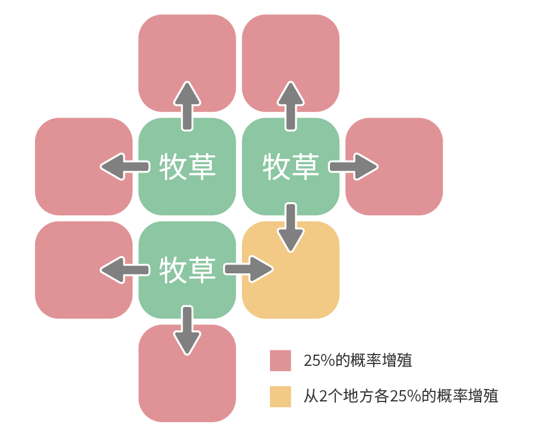

# 种植作物

这里将对赚钱所必不可少的耕种进行解说。

除了作物的培育方法，牧草和树木也会稍加总结。

- [前期准备](#培育作物的准备)
- [培育作物](#如何培育作物)
- [季节和作物](#季节和作物的关系)
- [作物的成长](#作物的成长)
- [作物的品质](#作物的品质)
- [土地状态](#会变化的土地状态)
- [牧草](#牧草的成长)
- [果树](#果树的采集物)

## 培育作物的准备

作物得在牧场的土地里面培育。游戏刚开始时土地处于荒芜状态，所以我们得先把碍事的东西给清理掉。

杂草按就能拔掉。

「树枝」和「石头」也是一样。这两个弄成后述的「木材」和「石材」比较好。

清理一定程度以后，从杂货屋买点种子回来吧！

拔起来的杂草会变成道具，拿去出货的话 1 个 1G。

要种植作物种子必不可少，最初的 3 种种子各买一个比较好。

### 储存木材和石材

四散在土地各处的树桩和石头，用斧头和锤子破坏后能够获得「木材」和「石材」。

这些东西在扩建时会用到，要存起来，别拿去卖掉了。

最开始只能破坏「树枝」和「石头」，不过随着道具改造，达到一定的蓄力等级以后，

其他的「树桩」和「岩石」也将变得可以破坏。

#### 可以变成木材的东西

| 用斧头破坏 | 蓄力等级      |
| ---------- | ------------- |
| 树枝       | 无需蓄力      |
| 树桩       | 蓄力 Lv2 以上 |
| 坚固的树桩 | 蓄力 Lv4 以上 |

#### 可以变成石材的东西

| 用锤子破坏 | 蓄力等级      |
| ---------- | ------------- |
| 石头       | 无需蓄力      |
| 大石头     | 蓄力 Lv2 以上 |
| 岩石       | 蓄力 Lv3 以上 |
| 大岩石     | 蓄力 Lv5 以上 |

## 如何培育作物

清理完了土地就开始种作物吧。种植方法特别简单。

用锄头在空地上耕作，并撒上种子浇上水，最后就能收获了。

最好能够每天给作物烧水，但下雨天就不需要了。

干农活会消耗自己的体力，所以刚开始的时候还是小范围的耕种吧。

推荐把每天的浇水时间维持在 4~5 小时左右。

#### 收获作物为止的流程

1. 耕作：在空地上使用锄头就能耕作
2. 播种：在耕作过的土地上使用种子
3. 浇水：使用装好水的水壶给作物浇水
4. 收获：作物成熟以后，按 A 按钮就能收获

### 耕作范围应该以 3x3 格为单位

一个作物的种子能够播种 3x3 格的范围。所以以 3x3 格为单位来耕作的话播种时就能没有浪费。

另外，播种的时候，要在 3x3 格的中心使用作物的种子。要注意撒到外面还没耕作的土地上的话就会浪费了。

#### 从土里出来的硬币和地鼠

耕作土地时，有时会出来「硬币」、「力量果实」和「地鼠」。

「硬币」会以 3.9%的概率不停出现，数量在 5 枚~20 枚之间变化（1 枚 1G）

「力量果实」的出现几率为 1.2%，并且只能获得一次。

「地鼠」的出现几率是 2%，使用锤子敲它的话能够提高牧场度。

地鼠稍作停留就会躲回去了，在那之前敲它！

## 季节和作物的关系

每个季节能够种植的作物是固定的。秋天的种类比较多。

如果种下了不合季节的种子的话，第二天它们就会枯死，所以要注意不要种错种子了。

另外，因为没有能够在冬天种植的作物，所以需要找别的方法来赚钱。

#### 能够种植的作物

1. 春：芜菁、马铃薯、黄瓜、草莓、卷心菜、月泪草（花）、三色花（花）
2. 夏：番茄、玉米、洋葱、南瓜、凤梨、粉色猫薄荷（花）
3. 秋：茄子、胡萝卜、番薯、菠菜、红豆、辣椒、青椒、奇幻朱草（花）、橙色维纳斯（花）

### 季节变化之际收获后割掉

种好的作物在季节变化之后会全部枯萎。

~~也不一定，毕竟有种东西叫换季 BUG。~~

在 30 日收获后剩下的作物，可以用镰刀全部割掉。

那样的话，下个季节的 1 日开始就能开始播种了。

种植范围越广收割就越需要时间，所以最好能够早点开始。

※ 在当月已经无法收获的作物，没到 30 日就收割掉也行

#### 稀少的红色奇幻朱草

「红色奇幻朱草」是料理「春之太阳」所需的材料之一。

培育「蓝色奇幻朱草」时突然变异而成的稀少种，概率仅仅只有**5%** 。

想要大量获得的话，尽量大范围的种植「蓝色奇幻朱草」吧！

## 作物的成长

给作物浇水使它们成长。基本的成长过程是，发芽，茎干生长，结果。

不同作物的成长天数也不同，收获为止所需的天数也都不一样。

不同作物的成长过程和成长天数可以参考**[种子](../tools/crop)**。

另外，如果忘记了浇水的话，每忘记一次，成长就会延迟一天。

#### 作物的成长例子(番茄)

| 状态     | 天数     | 说明                                             |
| -------- | -------- | ------------------------------------------------ |
| 种子     | 2 天     | 番茄的话这种状态会维持 2 天                      |
| 发芽     | 2 天     | 发芽藤蔓开始生长。还是成长的初期阶段             |
| 茎干生长 | 2 天     | 茎干成长，并带有许多叶子，开花                   |
| 结果     | 3 天     | 花落结果，但果实仍然青涩                         |
| 成熟     | 能够收获 | 种子开始的第 10 天。果实变红并进入可以收获的状态 |

### 单作作物和连作作物

作物分为「单作」和「连作」两种。

单作作物在收获后需要再次播种。

连作作物在收获后会留下茎干，持续浇水的话就能再次收获。

连作作物的优点就是只需要一开始撒一次种子，就能不停的收获。

但是，大部分连作作物到第一次收获的成长时间都很长。

#### 收货后的不同

「单作」收货后就没了。土地会回到耕作状态，能够继续播种

「连作」收货后会回到结果的前一阶段。每天浇水的话能够再次结果收获

#### 作物的最短收获天数

| 季节       | 作物 | 连单 | 收货日数 | 连作日数 |
| ---------- | ---- | ---- | -------- | -------- |
| 春         | 芜菁 | 单作 | 5        | -        |
| 马铃薯     | 单作 | 8    | -        |
| 黄瓜       | 连作 | 10   | 5        |
| 草莓       | 连作 | 10   | 3        |
| 卷心菜     | 单作 | 15   | -        |
| 月泪草     | 单作 | 7    | -        |
| 三色花     | 单作 | 13   | -        |
| 夏         | 番茄 | 连作 | 10       | 3        |
| 玉米       | 连作 | 15   | 3        |
| 洋葱       | 单作 | 8    | -        |
| 南瓜       | 单作 | 15   | -        |
| 凤梨       | 连作 | 21   | 5        |
| 粉色猫薄荷 | 单作 | 7    | -        |
| 秋         | 茄子 | 连作 | 10       | 3        |
| 胡萝卜     | 单作 | 8    | -        |
| 番薯       | 连作 | 7    | 3        |
| 菠菜       | 单作 | 6    | -        |
| 红豆       | 连作 | 11   | 4        |
| 辣椒       | 连作 | 13   | 5        |
| 青椒       | 连作 | 8    | 2        |
| 朱草       | 单作 | 11   | -        |
| 橙色维也纳 | 单作 | 11   | -        |

## 作物的品质

收获的作物存在 5 种品质。品质能够影响出货额，体力的回复量，以及部分料理的食谱入手。

不过，送礼的效果，作为料理材料使用的场所（如：收获祭），做成的料理的效果都不受影响，

所以低品质的作物用来做这些就好。

#### 品质的 5 阶段

就算是同样的作物，品质不同的话在背包和冰箱里就不能合在一起

#### 品质所影响的要素

- 出货额（下表）
- 吃下后的体力回复量（下表）
- 特定料理的食谱灵光一闪所需制作次数减少

| 上升要素   | 品质 |     |     |     |     |
| ---------- | ---- | --- | --- | --- | --- |
| 1          | 2    | 3   | 4   | 5   |
| 售价倍率   | 0    | 1.1 | 1.2 | 1.3 | 1.4 |
| 体力回复量 | 0    | +1  | +2  | +3  | +4  |

#### 品质不影响的要素

1. 拿去做料理所做成的料理的效果
2. 送给居民时的效果

### 通过土地的扩建提高品质

作物的品质和土地 Lv 息息相关。  
土地的 Lv 越高就越容易得到高品质的作物。

土地能通过扩建来提高 Lv，但每年只能提高 1 级。

记得每年存些钱去升级呀！

| 土地等级 | 作物的品质 |        |        |        |     |
| -------- | ---------- | ------ | ------ | ------ | --- |
| 品质 1   | 品质 2     | 品质 3 | 品质 4 | 品质 5 |
| 1        | 90%        | 10%    |        |        |     |
| 2        | 70%        | 20%    | 10%    |        |     |
| 3        | 40%        | 30%    | 20%    | 10%    |     |
| 4        | 20%        | 25%    | 25%    | 20%    | 10% |
| 5        | 15%        | 15%    | 25%    | 25%    | 20% |

#### 浇水和收获时有用的平行移动

按着的同时操作的话，主人公就能不改变面部朝向的移动。

洒水壶在改造之前只能一格一格的浇水，如果觉得只使用来调整位置比较难的话，

不妨试试这个操作。这同样也适用于作物的收获。

能保持朝向，并且前后左右移动，浇水和收获都会方便。

## 会变化的土地状态

每过一天，土地都会长杂草，耕作过的地退回空地，变得越来越荒芜。

这些变化会随着季节和天气而又不同的概率，台风和大雪之后土地会受到大损失。

天气无法回避，所以在天气预报知道台风和大雪要来的话，在来之前就得把能做的做好

### 变化的内容和概率

| 每格的变化             |                | 变化的概率 |      |      |      |      |          |      |      |      |      |
| ---------------------- | -------------- | ---------- | ---- | ---- | ---- | ---- | -------- | ---- | ---- | ---- | ---- |
| 春                     |                | 夏         |      |      | 秋   |      | 冬（※3） |      |      |
| 对象                   | 变化的内容     | 晴         | 雨   | 晴   | 雨   | 台风 | 晴       | 雨   | 晴   | 雪   | 大雪 |
| 栅栏                   | 栅栏坏掉       | 0.4%       | 2.3% | 0.4% | 3.1% | 4.7% | 0.4%     | 2.3% | 0.8% | 3.1% | 4.7% |
| 耕地                   | 变成空地（※1） | 0.8%       | 0.8% | 0.4% | 0.8% | 1.6% | 0.8%     | 0.8% | -    | -    | -    |
| 长杂草（※1）           | 0.4%           | 0.8%       | 0.8% | 1.2% | 1.2% | 0.4% | 0.8%     | -    | -    | -    |
| 放置石头               | -              | -          | -    | -    | 0.8% | -    | -        | -    | -    | -    |
| 空地                   | 长杂草         | 0.8%       | 1.2% | 1.2% | 2%   | 3.9% | 0.4%     | 2%   | -    | -    | -    |
| 出现石头               | -              | -          | -    | -    | 1.2% | -    | -        | -    | -    | -    |
| 出现树枝               | -              | -          | -    | -    | 0.8% | -    | -        | -    | -    | -    |
| 种子的格子             | 变成耕地       | -          | -    | -    | -    | 3.9% | -        | -    | -    | -    | -    |
| 全部的格子             | 出现石头       | -          | -    | -    | -    | -    | -        | -    | -    | -    | 1.2% |
| 出现树枝               | -              | -          | -    | -    | -    | -    | -        | -    | -    | 0.8% |
| 出现大石头和岩石（※2） | -              | -          | -    | -    | 100% | -    | -        | -    | -    | 100% |

※1：种有作物的格子不算在内

※2：大石头或者岩石合计出现 2 个

※3：冬天出现在雪上

### 用锤子去掉坏掉的栅栏

把「木材」放置在土地上，就会埋入地面，连起来就成了栅栏。

但随着时间流逝，栅栏会有一定概率坏掉。

用锤子锤坏掉的栅栏就能变回空地。

想维持栅栏的话再次放置「木材」就行了

坏掉的栅栏会变短。  
用锤子敲打就会消失掉，变回空地。

#### 黄金木材做成的栅栏不会坏掉！

「木材」做成的栅栏会随着时间坏掉，但「黄金木材」可不会。

但是「黄金木材」是贵重物品。满足条件后可以从「黄金木材」购入，价格为 1 个 10 万 G。

要使用「黄金木材」作为栅栏，需要很长的时间吧。

「黄金木材」是金色的，看着很漂亮。但就是太贵了。

## 牧草的成长

土地的东南方向在一开始就种有牧草，每天有一定概率增殖。

增殖方式请见下图，条件是旁边的格子是空地。

想要高效的增殖的话，清理掉靠在牧草旁边的杂草和石头之类的东西吧。

牧草之间隔着 1~2 格也比较好

为牧草之间清理出空地，确保能够增殖的空间吧！

#### 牧草是怎么增加的

### 春 1 日会复活 70%

冬天整片土地都会覆盖上雪花，牧草也会全部枯萎掉。

但是当下一个春天到来之时，秋天阶段剩下的牧草的**70%**左右会重新出现。

不同季节所能种植的作物不同，所以快到冬天之前把所有的作物都割掉也没问题。

牧草不能全部割掉，最好留下 10 格以上。

### 使用「牧草的幼苗」

饲养动物需要用到牧草，总是留下一些用来增殖是基本的方法。

不小心全部割掉的时候，从杂货店购入「牧草的幼苗」来重新种植把。

但是，一个 500G 有点小贵。从节省开支来说，也得注意不能割过头了。

「牧草的幼苗」是一种道具，在想种的地方按

#### 收割时有机会得到各种草

在用镰刀收割作物，牧草，杂草时，有一定概率会出现「红草」、「蓝草」等各种颜色的草。

这些和地图上春天到秋天能采集到的草相对应。

草能用于制作各种料理，记住这个采集之外的入手方法吧！

收割的瞬间飞出来了的话，别忘了回收。

## 果树的采集物

牧场的果树能产出水果和「蜂蜜」。

水果有 3 种，各能够采集 2 个季节。

不管哪种果树，一整年都能采集到「蜂蜜」。

果树不会像作物那样枯萎，等到下次对应的季节到来，仍然能够结果。

另外，水果能在部分地图上采集到，但「蜂蜜」只能在牧场的果树上采集。

只要有果树每天都能免费拿到东西。

特别在初期，是一份可观的收入。

#### 果树的采集物

| 树木     | 采集物       | 收获的季节     |
| -------- | ------------ | -------------- |
| 山葡萄树 | 山葡萄的果实 | 春、夏         |
| 苹果树   | 苹果         | 夏、秋         |
| 橘子树   | 橘子         | 秋、冬         |
| 全部果树 | 蜂蜜         | 春、夏、秋、冬 |

### 水果的数量和蜂蜜的出现是随着天气变化

水果和「蜂蜜」每天以一定概率出现。

出现率随着天气变化，晴天的概率会更高。

**另外如果在田里种有鲜花的话，「蜂蜜」的出现率全天气增加 10%。**

相维持鲜花的效果的话，留一个处于能收获状态下的鲜花在地里把。

#### 水果的数量和蜂蜜的出现率

| 天气 | 水果的数量 |      |     | 蜂蜜的出现率 |
| ---- | ---------- | ---- | --- | ------------ |
| 1 个 | 2 个       | 3 个 |
| 晴   | 70%        | 50%  | 30% | 80%          |
| 雨   | 60%        | 50%  | 25% | 50%          |
| 雪   | 50%        | 30%  | 20% | 30%          |

### 果树的增加和替换

在「伐木之家」能够购入果树，最多拥有 5 棵。

拥有不同种类的果树，就能在不同季节收获到不同的水果，同时「蜂蜜」也将更容易采集。

已经拥有 5 棵树之后，如果想换成别的果树的话，可以用斧头砍倒。

增加顺序为从「自宅」到「鸡兔笼舍」依次增加。

果树的数量和种类，是否有「蜂蜜」，可以在菜单的「地图」中确认。

「斧子」砍 8 次树就能砍倒，能获得 9 个「木材」
