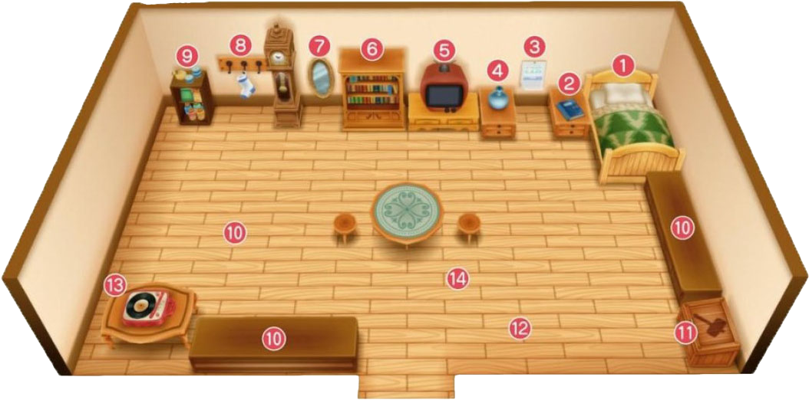

# 自宅

自宅作为主人公放松的场所，还有很多对牧场经营有用的物件。

在这里对这些物品的作用进行解说。

和牧场的设备相同，自宅也准备了许多设备。

能够回复体力的床，能够进行保存和读取的日记，

查看每月预定活动的日历还有各种收纳设施都很重要。

还有可以在「伐木之家」购买追加的设备。

1. 床

   最初拥有的设备。调查并选择「是」就可以睡觉。

   睡觉可以一定量的回复体力和疲劳度，并且时间会推移到第二天早上 6:00AM。

   当天的工作完成后，就睡觉到第二天吧。

2. 日记

   调查后和菜单中「日记」相同，可以进行保存和读取。

   选择「写日记」是保存，「读日记」是读取。

3. 日历

   调查后可以看到日历。日历中包括日期和星期，活动开办日和居民生日。

   并且，不仅可以看到本月的日历，按 R 键可以查看下个月的日历。

4. 花瓶

   事件「[旅行商人的拜访（花瓶）](../event/resident#旅行商人的拜访（花瓶）)」中从霍安手中购买。

   根据季节设置相应的花朵可以回复体力和疲劳度

5. 电视

   可以收看不同的电视频道。

   在「伐木之家」可以新做功能相同看起来更豪华的「液晶电视」

6. 书架

   「书本一览」中可以查看至今为止的出货数和钓鱼成果，以及至今为止信箱中收到的信件和教学。

7. 镜子

   调查后可以更换主人公着装。共有 12 类服装可以选择。

   如有购买特典 DLC，还会追加另外五种服装。

8. 袜子放置处

   事件「[爱莲的袜子](../event/resident#爱莲的袜子)」发生后，这里可以挂袜子。

   之后「[星夜赠礼](../life/event#星夜赠礼)」事件中会收到放在里面的礼物。

9. 整理柜

   可以收纳食物以外的道具。

   满足条件后，可以升级为容量更大的「大整理柜」和「豪华整理柜」

10. 冰箱
    可以收纳食物以外的道具。

    满足条件后，可以升级为容量更大的「大冰箱」和「豪华冰箱」

11. 陈列空间

    床下面的柜子是陈列空间，可以装饰特定的道具。

12. 道具箱

    和牧场外的道具箱相同，是用来收拾道具的箱子。

    内部是联动的，收进去的道具在哪里的道具箱都可以取出来。

13. 时钟

    游戏画面右上角的单位是以 10 分作为单位显示的，但有时钟之后当前时间是可以精确到分钟的。

    在「伐木之家」购买后设置。

14. 留声机

    从班先生处买入的设备。

    拥有各种「唱片」的话，可以选择曲子变更 BGM。

    「唱片」也是从班先生这边买入的。

15. 地毯

    自宅扩建两次后，满足条件的话就可以在「伐木之家」买到。

    没有特别的功能但是可以让室内装饰更添光彩。

## 可以观看的电视频道

电视节目基本上是按照星期来播送的。  
跨年的时候由特定的节目放松。也有能够得到奖品的节目，挑战试试吧。  
另外，镇上的别墅中有不一样的节目可以收看。

- **天气预报**：可以查看第二天的天气
- **超美味时间**
- **新年节目料理 EX**：可以学会料理配方
- **女神大人猜大小游戏**
- **女神大人猜拳游戏**
- **猜谜游戏**：根据结果会得到奖品

## 花瓶中花朵的装饰效果

如果花瓶中装饰有花朵，并且当第二天起床时花仍然开着的话，就会得到加成效果。

超过花朵的寿命期后，100/256 的概率会枯死。

如果想要持续的加成效果，就在花朵枯萎前换掉吧。

另外，如果装饰的花朵和季节不符，第二天就会枯萎。

需要装饰花朵或者替换装饰花朵的时候，就把花拿在手里接近并按。

| 季节       | 花朵           | 效果     | 花的寿命 |
| ---------- | -------------- | -------- | -------- |
| 春         | 月落草         | 体力+10  | 7 天     |
| 三色花     | 疲劳度-7       | 5 天     |
| 夏         | 粉色猫薄荷     | 疲劳度-5 | 5 天     |
| 秋         | 蓝色奇幻朱草   | 体力+3   | 10 天    |
| 秋         | 朱草 疲劳度-10 | 5 天     |
| 橘色维纳斯 | 疲劳度-20      | 2 天     |

## 多种多样的装饰品

床和柜子的陈列空间可以装饰摆放下列道具。

床可以在能走动的地方设置摆放，柜子有两个，每个有 3 个摆放空间。

祭会优胜奖杯和居民的礼物这样的纪念品都可以摆放。

### 可以摆放的道具

- 斗鸡节冠军奖杯
- 评牛节冠军奖杯
- 软绵绵节冠军奖杯
- 小矮人的的雕像
- 女神的雕像
- 河童的雕像
- 海盗宝藏
- 古代鱼的化石
- 装信的瓶子
- 里克的手表
- 格雷的胸针
- 格雷的手镯
- 克里夫的花饰
- 多特的疗愈小物件
- 凯的海之守护
- 布兰登的微观作品
- 布兰登的爱的雕塑
- 珀布莉的泥丸子
- 让玛丽感动的书
- 卡莲的葡萄果汁
- 艾丽的押花
- 兰的八音盒
- 珍妮弗的香包

## AM 4:44 发生的奇怪的信息的真相

电视节目在 AM 0:00 后放送全部结束，到 AM5:59 为止都是颜色栏。

但是，在 AM 4:44 打开电视的话，伴随着白噪画面会有诡异的信息…………

内容会根据星期不同，周一到周六共有 6 种情况。

这些信息其实是解除诅咒道具的方法。

※ 到了 AM 4:40 后，出入自宅让时间一点点前进并在时钟上确认 AM 4:44 吧！
