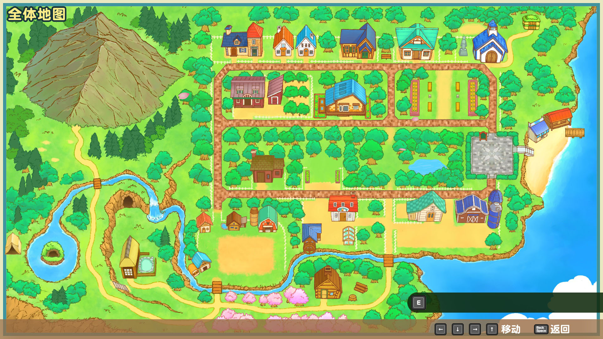

# 矿石镇地图

记载了包括矿石镇的所有地图中商店和设施、采集物和钓鱼场的数据，散步的时候使用吧。

除了主人公的牧场，地图分为九个区域。

矿石镇分为南侧和北侧两部分，地图从南部到西部分布有森林和圣母山脉这样自然气息浓郁的区域。

矿石镇的南北连接处有隐藏的秘密森林存在。

## 全体地图

### 矿石镇南侧 | 三个商店林立的小路

可以改造道具的「赛巴拉铁匠铺」，可以买到动物的「小鸡与莉莉娅」和「约德尔牧场」的林立的区域。

东西延伸的中央大街上有秘密森林的入口，往南走也可以到达森林。

河的下游有钓鱼场，流向牧场南边的河流和这里能够掉到的鱼是一样的。

### 矿石镇北侧 | 房屋集中的区域

许多住所和设置建在一起，贩卖牧场生活不可或缺的各种道具的「杂货屋」也在这里。

和矿石镇南侧相同，不但有通往秘密森林的道路，从东北的小道还能进入北方的森林。

#### 可以采集的物品

- 春 ：无
- 夏 ：红草、粉色猫薄荷
- 秋 ：红草、蘑菇、毒蘑菇
- 冬 ：无

### 北部森林 | 教堂后的广袤森林

被树木东西分开的区域。有「小矮人之家」的森林东侧需要从矿石镇北侧进入。

另一边森林西侧需要从「教堂」的右后门进入，但是「教堂」右后门是关闭着的，只有当事件「卡特的秘密」发生后才开放。

#### 可以采集的物品

- 春 ：无
- 夏 ：无
- 秋 ：蘑菇、毒蘑菇、松茸
- 冬 ：白草

### 秘密森林 | 小镇中心的森林

夹在矿石镇南北侧中间的森林。根据季节的变化可以采集到不同的采集物，还有钓鱼场。

这里是全年树桩和岩石会出现的场所，使用能够达到破坏树桩和岩石的蓄力等级的斧头和锤子，就可以获得木材和石材。

#### 可以采集的物品

- 春 ：蓝草、三色花、月落草
- 夏 ：红草、粉色猫薄荷、绿草、山葡萄
- 秋 ：蓝色奇幻朱草、红草、橘色维纳斯、蘑菇、毒蘑菇、橘子
- 冬 ：橘子

### 玫瑰广场 | 各种活动开展的场所

广场在矿石镇东部。平时下午玛娜，安娜和莎夏三人会在这里很起劲得闲聊。~~（八卦三人组）~~

另外作为活动会场的情况也很多，公告板上能够查看活动预告。

### 矿石海滩 | 夏季喧嚷的海边

玫瑰广场可通往海滩。这里有札克的家，夏天有凯的海之家营业，还会召开入海节等活动。

主要可以采集到各色草，钓鱼场垂钓种类也非常丰富。

此外，如果养了马之外的成年宠物，还可以调查海滩上的看板挑战飞盘小游戏。

持有飞盘并满足条件的情况下，可以和宠物玩飞盘。

全年可以钓到多种鱼类，还有 2 种鱼王。

#### 可以采集的物品

- 春 ：树枝、黄草、橙草
- 夏 ：树枝、紫草
- 秋 ：树枝、靛草
- 冬 ：橘子

### 森林 | 连接圣母山脉和城镇的森林

通往牧场和矿石镇南侧的区域。

虽然只有一个「伐木之家」在这里，但根据时间段的不同，可以在这里遇到去向圣母山脉的居民。

不但有挺多的采集物，这里也是树桩出现的场所，请记得这里是可以收集到木材的地方。

森林的中北部和圣母山脉的西北部是野生动物会出现的场所。

猴子，浣熊，雉鸡，熊和狐狸这 5 种动物会在不同的季节和不同的时间段出现。

季节和时间段变化后，在森林和圣母山脉散步的时候找找看吧。

所有动物都是靠近之后会迅速逃走的，观察的时候要保持一定的距离。

#### 可以采集的物品

- 春 ：蓝草、树枝、月落草
- 夏 ：蓝草、红草、树枝、山葡萄
- 秋 ：蓝色奇幻朱草、红草、树枝、蘑菇、毒蘑菇
- 冬 ：树枝、白草

### 圣母山脉 | 水源丰富的山丘

一直延续到山顶的山坡位置。这里有丰富的自然资源，泉水里住着女神，湖里住着河童，献上（丢入）物品就能见到他们。

春夏秋季可以采集到各种草、「竹笋」、「栗子」、等山货食材，也有很多钓鱼资源。

秋天将西南边大块的岩石破坏后就能到达采集「松茸」的地点。

泉之洞窟与湖之洞窟还是采矿场，可以在里面挖掘各色矿石。

温泉可以回复体力和疲劳度，可以用来缓解日间劳作的疲惫。

把鸡蛋扔进去的话还能获得「温泉蛋」。

#### 可以采集的物品

- 春 ：蓝草、树枝、竹笋、三色花、月落草
- 夏 ：蓝草、红草、绿草、树枝、粉色猫薄荷、山葡萄
- 秋 ：蓝色奇幻草、红草、绿草、树枝、蘑菇、毒蘑菇、松茸、栗子
- 冬 ：树枝

### 山顶 | 景致很好的山顶瞭望台

山顶是景色很好，开阔的高台。

人气不是很旺，一小部分居民会来这里散步，秋天的「赏月」活动可以和在意的人来这里赏月约会。

另外，年末的半夜到第二天清晨，这里会举行「跨年大会」一起欣赏新年的第一次日出。

## 地图中可以拾取的自然恩惠

根据季节的不同，可以获得各式各样的花朵和食材道具。

拾取东西是免费的，但是卖掉的话就会赚到钱。

根据场所的不同，全年都会出现可以变成木材的树枝和树桩，以及可以变成石材的岩石。

虽然出现这些东西的场所是确定的，但具体在哪里出现是每天根据特定概率变化的。

树桩和岩石会在特定的区域出现，道具改造之后就可以进行破坏。
