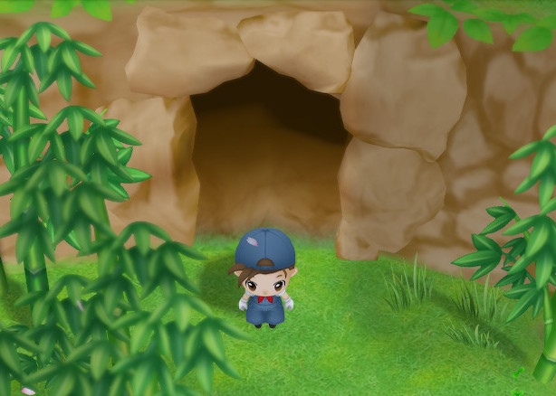
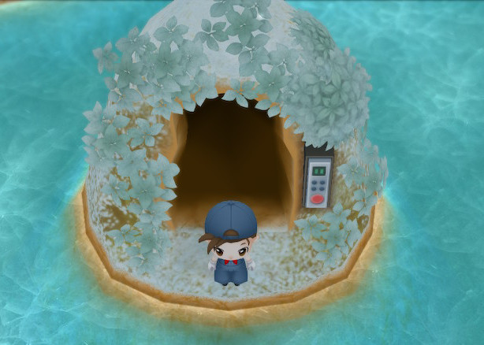

# 采矿

有「湖之采矿场」和「泉之采矿场」两个采矿场可以进行挖掘，「湖之采矿场」在冬天湖面结冰的时候才能步行进入，但取得「飞行石」后能直接飞往采矿场的入口，全年都能进入。

- [挖掘方法](#挖掘方法)

* [时间流动](#矿场内的时间流动)
* [陷阱](#警惕会使人掉下的陷阱)
* [矿石价格](#不同的矿石)
* [每层面积](#每一层的面积由层数决定)

- [特别物品](#能获得特别的物品)

* [女神的秘宝](#女神的秘宝)
* [河童的秘宝](#河童的秘宝)
* [谜之石板](#谜之石板)
* [飞行石](#飞行石)
* [雕像](#雕像)

- [诅咒道具](#诅咒道具)
- [每层可以挖到东西的概率](mining-list)

**泉之采矿场**  
入口位于圣母山脉的泉的旁边，从第一年的春天开始就可以进入。

**湖之采矿场**  
入口位于圣母山脉的湖的中心，在冬天湖面结冰的时候才能步行进入。

## 挖掘方法

- 挖掘地面

  用锄头挖掘空地后，有几率出现物品。

- 破坏石头

  用锤子破坏石头后，有几率出现物品。

### 矿场内的时间流动

在采矿场的同一层内时间是不流动的。但是每往下移动一层会经过 1 分钟，即每 10 层 10 分钟。

需要注意的是采矿场跟外面一样，超过 PM10:00 后在采矿场内使用道具的话会积累疲劳。

想要顺利一口气到达 255 层的话，需要在 PM5:44 前进入采矿场。

### 寻找通往下层的楼梯

- 通往下层的楼梯

  用锄头挖掘空地的话有一定概率出现通往下层的楼梯。

  同一层会有几个通往下层的楼梯，但一旦发现第一个楼梯后其他的就会消失。

  在返回楼梯周围的 8 格以及沿着外围墙壁的一圈不会出现通往下层的楼梯。

  **也有很小的概率整层都没有通往下层的楼梯，这时候读档回到上一层吧！**

- 返回楼梯

  从地下 1 层开始出现，对其进行调查可以回到地面。

  通往下层之后必定会出现在主人公附近。

### 警惕会使人掉下的陷阱！！！

一旦踩到陷阱会直接掉下 1 ～ 5 层，体力也会随之减少。

如果想要通往更深的层数，比起一层一层地去寻找通往下层的楼梯，不妨可以利用陷阱进行快速移动。

根据层数不同有一定的概率存在陷阱，也有没有陷阱的层数。

踩到陷阱会直接掉下 1 ～ 5 层，体力也会随下降的层数减少（如下表）。

| 落下层数 | 消耗体力 |
| -------- | -------- |
| 1        | -20      |
| 2        | -30      |
| 3        | -40      |
| 4        | -60      |
| 5        | -70      |

※ 本来有石头的地方不会有陷阱

※ 使用锄头挖掘地面的话能发现陷阱

### 两个采矿场会出现不同的矿石

破坏石头出现的矿石会根据采矿场的不同而存在差异。

「泉之采矿场」主要获得的是与道具改造相关的矿石。

「湖之采矿场」获得的矿石主要用来出货或者当做礼物赠送给村民。

「贤者之石」是非常贵重的矿石，当满足条件后会出现在「泉之采矿场」。

#### 泉之采矿场

| 矿石       | 出货额  |
| ---------- | ------- |
| 废矿石     | 1G      |
| 铜         | 15G     |
| 银         | 20G     |
| 金         | 25G     |
| 秘银       | 40G     |
| 山铜       | 50G     |
| 精金       | 50G     |
| 贤者之石 ※ | 20,000G |

※ 贤者之石会在所有的诅咒道具（6 种）解除诅咒后才会出现

#### 湖之采矿场

| 矿石       | 出货额  |
| ---------- | ------- |
| 废矿石     | 1G      |
| 月亮石     | 55G     |
| 沙漠玫瑰石 | 60G     |
| 钻石       | 100G    |
| 祖母绿     | 80G     |
| 红宝石     | 75G     |
| 玛瑙       | 62G     |
| 紫水晶     | 60G     |
| 翡翠       | 62G     |
| 黄玉       | 70G     |
| 橄榄石     | 68G     |
| 萤石       | 65G     |
| 蓝宝石     | 75G     |
| 海蓝宝石   | 60G     |
| 石榴石     | 75G     |
| 绿松石     | 50G     |
| 亚历山大石 | 10,000G |
| 粉红钻石   | 10,000G |

### 每一层的面积由层数决定

采矿场每一层的面积会根据层数的不同存在差异。

面积最大的是层数为 5 的倍数时，面积为 28×28 格。

层数为 3 的倍数时，面积为 13×14 格。其他层数为最小的 13×6 格。

面积越广，当层有的石头就越多，最大面积的层数会有 300 个石头。

所以如果是目标矿石出现的层数的话，获得的几率也会增加。

## 能获得特别的物品

采矿场里除了矿石还能获得其他特别的道具及物品。

挖掘地面的话有可能会出现下面的共同道具。

建议尽快获得其中的「力量果实」

| 物品     | 出现场所                                                                                |
| -------- | --------------------------------------------------------------------------------------- |
| 金币     | 所有层数都会出现，层数越深出现几率越大。                                                |
| 黑草     | 出现在泉之采矿场 102~205 层以外的层数，湖之采矿场的全层数。根据层数不同出现几率也不同。 |
| 力量果实 | 在泉之采矿场的 100 层以及湖之采矿场的 19 层有 19.5%出现，只能获取一次。                 |

### 女神的秘宝

- 效果  
  选择为道具后每分钟回复 1 点体力。
- 获得方法  
  在泉之采矿场的特定层数破坏石头后有几率获得「女神之玉」。收集齐 9 个「女神之玉」后能获得「女神的秘宝」。
- 获取位置（出现机率）

  地下 60 层（3.9%）

  地下 102 层（3.9%）

  地下 123 层（3.9%）

  地下 152 层（3.9%）

  地下 155 层（3.9%）

  地下 171 层（3.9%）

  地下 190 层（3.9%）

  地下 202 层（3.9%）

  地下 222 层（3.9%）

「女神的秘宝」是能分别回复体力的道具。

需要各收集「女神之玉」9 个后才能获得。

「女神之玉」在泉之采矿场的特定层数以一定的概率出现。

因为每层只能获得一个，所以请记住已经获取了的层数，再去其他层数进行搜索。

### 河童的秘宝

- 效果  
  选择为道具后每分钟回复 1 点疲劳。
- 获得方法  
  在湖之采矿场的特定层数破坏石头后有几率获得「河童之玉」。收集齐 9 个「河童之玉」后能获得「河童的秘宝」。
- 获取位置（出现机率）

  地上 1 层（0.4%）

  地下 40 层（0.4%）

  地下 60 层（0.4%）

  地下 80 层（0.4%）

  地下 120 层（0.8%）

  地下 140 层（0.8%）

  地下 160 层（0.8%）

  地下 180 层（0.8%）

  地下 255 层（19.5%）

「河童的秘宝」是能回复疲劳的道具。

需要各收集「河童之玉」9 个后才能获得。

「河童之玉」在湖之采矿场的特定层数以一定的概率出现。

因为每层只能获得一个，所以请记住已经获取了的层数，再去其他层数进行搜索。

### 谜之石板

- 效果  
  能学或「番茄酱」的食谱，拿到时就会学会。
- 获得方法  
  在泉之采矿场的地下 255 层挖掘地面有 19.5%的几率获得。

「谜之石板」是记载了「番茄酱」食谱的道具。

虽然优先度不高，但是如果想要达成成就的话就是必要的物品。

顺带一提，如果直接卖给霍安的话能卖到 70000G（基础价），但是只能获取一个。

### 飞行石

- 效果  
  在地图上选取想去的位置后可以瞬间移动。
- 获得方法  
  在第 3 年的春 1 日后（包含春 1 日）在泉之采矿场的地下 255 层破坏石头有 19.5%的几率获得。

使用「飞行石」能瞬间移动到地图指定位置，是非常方便的道具。

#### 使用方法

1. 「飞行石」属于道具的一种，需要将其放到道具栏。
2. 按使用后，在弹出的地图界面选择想去的位置。
3. 按确定后即可瞬间移动。每移动一次会消耗 2 点体力。

#### 要注意！使用飞行石时有可能会错过事件

飞行石除了能在室外使用，在室内和采矿场同样可以使用。

经常使用飞行石移动的话可能会错过一些需要进入特定场所时才能触发的事件。

例如，节日的前一天会在主人公出门后触发告知事件。

但如果当天起床后直接使用飞行石瞬间移动的话将会错过告知事件。所以请注意类似情况。

### 雕像

「女神雕像」「河童雕像」「小矮人雕像」可以装饰在家里。

「女神雕像」「小矮人雕像」可以在泉之采矿场获得。「河童雕像」可以在湖之采矿场获得。

虽然每层的出现率不高，但是出现层数是连续的，所以获得也是比较容易的。

#### 女神雕像

「泉之采矿场」地下 220~249 层，挖掘地面有 9.8%的几率获得。

#### 小矮人雕像

「泉之采矿场」地下 160~189 层，挖掘地面有 9.8%的几率获得。

#### 河童雕像

「湖之采矿场」地下 101~120 层、地下 201 ～ 220 层，挖掘地面有 9.8%的几率获得。

## 诅咒道具

在「湖之采矿场」的特定层数里能获得 6 种诅咒道具。

把这些道具的诅咒解除后会变成 LV6 的祝福道具。

解除诅咒的方法各有不同，请参照下面的方法。

装备上诅咒道具后，如果不去教堂的忏悔室进行卸下的话是不能脱下更换道具的，在教堂每次卸下需要 1000G。

### 诅咒道具获得位置

| 道具         | 获得位置                 |
| ------------ | ------------------------ |
| 诅咒的钓竿   | 「湖之采矿场」地下 29 层 |
| 诅咒的锄头   | 「湖之采矿场」地下 39 层 |
| 诅咒的斧头   | 「湖之采矿场」地下 49 层 |
| 诅咒的锤子   | 「湖之采矿场」地下 59 层 |
| 诅咒的洒水壶 | 「湖之采矿场」地下 69 层 |
| 诅咒的镰刀   | 「湖之采矿场」地下 79 层 |

### 解除诅咒的方法

#### 诅咒的锄头/诅咒的洒水壶

- 在教堂的忏悔室里进行 5 次卸下诅咒道具

  装备上诅咒道具后，在教堂的忏悔室里进行 5 次卸下诅咒道具，可以连续 5 次。

  忏悔室会在星期一和星期三以及不是晴天的日子 PM1:00~PM3:00 开放。每次卸下诅咒道具需要 1000G。

  ※准备 5000G，在忏悔室开放的时间进去连续卸下诅咒道具 5 次后即可解除诅咒。

#### 诅咒的钓竿/诅咒的斧头

- 使用 50 次

  装备上道具后使用 50 次即可解除诅咒。

  使用诅咒道具会比正常的道具更加耗费体力及疲劳，建议一边使用一边进行回复。

  由于在屋内进行空挥也是计数的，如果自宅增建了浴室的话，可以一边使用一边进行回复。

  ※ 我的建议是去旅馆吃东西，毕竟使用浴室会时间流逝，但是吃饭不会。

#### 诅咒的锤子/诅咒的镰刀

- 连续装备 5 天

  以装备着诅咒道具的状态连续经过 5 天即可解除诅咒。

  由于 5 天内不能使用其他道具，建议这 5 天牧场的工作可以依赖小矮人。

  若途中去教堂进行卸下的话天数会清零，需要重新计数。

## 每层可以挖到东西的概率

在「[这个页面](mining-list)」查看。
