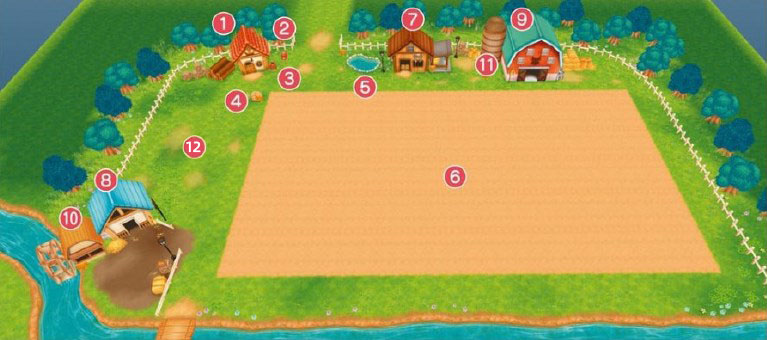

# 牧场设施

牧场的设施是在生活不可缺少的重要的东西。

让我们对能够进行耕种、饲养的场所、道具箱以及出货箱等装置设施进行了解吧。

## 梳理下牧场经营不可缺少的设备吧!

在牧场里不仅有主人公的自己的家、大致还有能够进行耕种的农田以及能够饲养动物的小屋等设施。

虽然这些设施从一开始就可以利用，但是要培育的农作物以及最初需要培育的动物都必须要在店里面进行购买。

### 1. 自己的家

主人公的家、早上从自家的床上醒来后开始工作。

### 2. 邮箱

不时会收到信件，调查邮箱之后就可以阅读信件的内容。  
收到新邮件时会在邮箱上用标记标识出来。

### 3. 道具箱

能够拿出放入道具的箱子。  
背包满了放不进去的道具就都放在这里吧。

### 4. 出货箱

把想要出货的东西放入这里后，PM5:00 札克来回收的时候，会把出货的物品换成金钱后加算到所持金钱里。

一旦放入的东西是没有办法再拿出来的。

### 5. 养殖池

给农作物浇水时取水的场所。靠近水池以后使用「洒水壶」后，能够将「洒水壶」灌满。

另外这里还可以将钓上的鱼储存起来。

### 6. 田地

能够培育农作物的土地。一共有 43\*25 格，耕作之后就能种下种子。如果不对土地进行修整的话就会慢慢变荒芜。

### 7. 马厩

宠物「马」睡觉休息的地方。  
在下雨的时候马也会在小屋里。  
调查里面的水槽以后会发现「真实之玉」。

### 8. 鸡兔笼舍

饲养鸡和安哥拉兔的地方。  
能够饲养的数量不管种类如何最多 4 只（扩建后 8 只），饲料箱设置有 4 个。

鸡的话在孵化箱中放入鸡蛋之后可以进行繁殖。安哥拉兔在初期状态下是没有办法繁殖的。

- 加工机放置处  
  在赛巴拉铁匠铺购买各种的加工机后就会放在这里
- 孵化箱  
  想要孵化鸡的时候就在这里放置鸡蛋
- 出货箱  
  能够放入想要出货的东西的箱子，和屋子外是同样的效果
- 饲料放置处  
  可以存放「鸡兔饲料」，也可以取出来，调查左边的看板可以知道存储的饲料的数量
- 饲料箱  
  在给动物们喂饲料的时候放置饲料的地方

### 9. 动物小屋

饲养各种的牛、羊、羊驼的地方，除了配备了繁殖的时候使用的怀孕用饲料箱以外还有三个加工机放置地。

饲料箱以及出货箱等基本的设备和鸡兔笼舍是一样的。

- 加工机放置处  
  在「赛巴拉铁匠铺」购买各种的加工机后就会放在这里
- 怀孕用饲料箱  
  正在怀孕的动物使用的饲料箱
- 出货箱  
  能够放入想要出货的东西的箱子，和屋子外是同样的效果
- 筒仓  
  可以存放「干草饲料」，也可以取出来，调查左边的看板可以知道存储的饲料的数量
- 饲料箱  
  在给动物们喂饲料的时候放置饲料的地方

### 10. 水车磨坊

往这里面投入「玉米」以后能够变成「鸡兔饲料」并且储存起来。

### 11. 筒仓

和「动物小屋」里面的筒仓是连接在一起的，这里也能取出或放入「干草饲料」

### 12. 果树区

种植可以采取各种水果以及蜂蜜的果树的地方。  
一开始的时候只种有一棵山葡萄树、通过扩建最多可以种植 5 棵。
