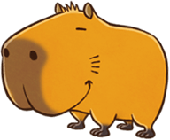

# 饲养宠物

无法从宠物身上采取副产品，可以让宠物参加「赛马」、「入海节」等活动。

有 5 种类型的宠物：马、猫、企鹅、犬、水豚。

猫和犬各有三种、企鹅和水豚有两种不同的颜色。

马通过事件获得，其他的宠物可以通过购买获得。

## 宠物的种类

### 马

### 猫

美国短毛猫、孟加拉猫、三花猫

### 企鹅

企鹅、深蓝色企鹅

### 狗

矿石镇犬、黑柴犬、蝴蝶犬

### 水豚

水豚、白水豚

## 获得方法

- 马：通过事件「放手马」或「获得马」获得。
- 其他宠物：在班的宠物商店购买

## 宠物的成长天数

和动物相同，宠物也需要经过一定的时间才能成年。

通过事件「寄养马」而被委托照料幼马，**90 天**后，如果好感度不高的话（少于 100），会进入「放手马」的支线事件。

需要注意的是，进入这个支线，获得马的时机会延迟一年。

除了马以外其他的宠物刚买入时也是幼年状态，经过**60 天**之后长为成年状态。

马以外，包括不同颜色的宠物最多只能饲养 5 只。

拥有第二只宠物以后，在饲养的宠物的好感度平均值到达 8 心以上前无法继续购买。

好感度的阶段与动物的好感度是一样的机制，通过不同方法能稍许提高。

「宠物点心」能在宠物店购入，想要大量购入需要金钱。

## 提高宠物好感度的方法

- 对话（成年马以外）：+1
- 刷毛（仅限马）：+1
- 吹哨（用呼唤）：+1
- 喂宠物点心（成年马以外）：+1

在「关系状况」的「宠物」画面，三个图标分别为「对话」「点心」「刷毛」。

拥有「王冠」表示在活动中获得过优胜。

幼年时期可以通过图标知道是否已经喂点心。

## 宠物的训练度

宠物拥有训练度，可以通过不同方法提高。

绿色进度条代表训练度，通过对宠物进行特定的行动提升，到达右端则表示训练度已经到了最大值 250 点。

赛马时训练度越高越容易获胜，所以每天都去提高一点马的训练度吧。

其他宠物的训练度会影响飞盘的飞行距离。

### 提高训练度的方法

- 骑乘（成年马）

  骑乘马可以使训练度提升 1，和骑马的时间无关，乘上去后马上下来也可以。1 天可以提升 1 次。

- 投掷球（马以外）

  从霍安那里可以买到「球」，拿着球在宠物附近投掷，宠物捡回球后训练度提升 1，1 天可以提升 1 次。

  训练的场所在自宅或外面都可以，但夜里动物睡着后无法进行。

- [飞盘游戏](event#飞盘游戏)（马以外）

  从霍安那里买到「飞盘」可以在「矿石海滩」进行。

  1 次挑战中可以投掷的次数随好感度变化，在宠物厌倦的时候会结束。

  宠物每追上飞盘一次，训练度提升 1。

#### 挑战的最大次数

| 好感度 | 最大次数 |
| ------ | -------- |
| 0      | 0 次     |
| 1-2    | 1 次     |
| 3-4    | 2 次     |
| 5-7    | 3 次     |
| 8-9    | 4 次     |
| 10     | 5 次     |

### 在沙滩上挖坑可能会获得道具

在海滩玩飞盘游戏的话，宠物说不定会在沙滩上挖坑。

这个行为在满足下面的条件后会有一定几率发生。

运气好的话能够发现道具。

能够入手的道具有 8 种，甚至可能会获得「古代鱼化石」。

#### 发现道具的条件

1. 持有物有 1 格以上的空位
2. 宠物的训练度在 101 以上
3. 把滑标停在 ②~③ 的范围内，并且飞盘的飞行距离在 30m 以上
4. 宠物去追飞盘了

#### 可以被挖到的道具及概率

- **古代鱼化石**：3%
- **玛瑙**：10%
- **金**：10%
- **银**：15%
- **铜**：20%
- **树枝**：20%
- **鱼骨**：12%
- **空罐**：10%

### 饲育的宠物在活动中出场

宠物可以出场的活动有 3 种，获胜能获得奖品

| 活动                               | 对应的动物、宠物   |
| ---------------------------------- | ------------------ |
| [春季赛马](event#春季赛马)         | 马                 |
| [秋季赛马](event#秋季赛马)         |
| [入海节（飞盘大赛）](event#入海节) | 猫、企鹅、犬、水豚 |
