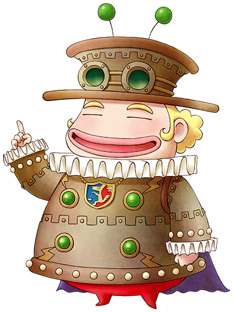

# 美食家

流浪的料理评论家，人如其名对美食特别在行。  
在春天举行的美食节上担任着评委。

## 简略说明

- 登场：活动「美食节」
- 住所：其他
- 性别：男
- 生日：春 21 日（春 20 日）
- 家庭成员：无

## 喜欢与讨厌的物品

- 最喜欢：-
- 很喜欢：艾利草
- 喜欢：温泉蛋、山葡萄水、咖喱饭、炒饭、大阪烧、三明治、果汁、曲奇、蛋糕、放松茶的茶叶、布丁
- 普通：芜菁、土豆、鸡蛋
- 讨厌：无
- 很讨厌：体力药、月落草

## 行程

| 状况                   |                    | AM   |     |     |     |     |     | PM  |     |     |     |     |      |     |      |     |     |     |     | AM  |
| ---------------------- | ------------------ | ---- | --- | --- | --- | --- | --- | --- | --- | --- | --- | --- | ---- | --- | ---- | --- | --- | --- | --- | --- |
| 6                      | 7                  | 8    | 9   | 10  | 11  | 12  | 1   | 2   | 3   | 4   | 5   | 6   | 7    | 8   | 9    | 10  | 11  | 12  |
| 单身                   | 美食节以外         | 不在 |     |     |     |     |     |     |     |     |     |     |      |     |      |     |     |     |     |     |
| 美食节                 | 不在               |      |     |     |     |     |     |     |     |     |     |     | 广场 |     | 不在 |     |     |     |     |
| 婚后                   | 每月 10、20、30 日 | 自家 |     |     |     |     |     |     |     |     |     |     |      |     |      |     |     |     |     |     |
| 每月 10、20、30 日以外 | 不在               |      |     |     |     |     |     |     |     |     |     |     |      |     |      |     |     |     |     |

## 在美食节当天送「艾利草」吧

美食家最喜欢的东西是「艾利草」。

制作材料的「放松茶的茶叶」可以从事件「小矮人的茶会」获得，或者以草类物品为材料在厨房制作。

制作「艾利草」不容易，但为了能在美食节当天送给他，事先准备好吧。

因为只有这一天能给他送礼，事先在杂货店包装一下的话，效果有更好哦。

美食节结束以后的广场上，可以把礼物送给美食家。

不好制作「艾利草」时，送「温泉蛋」也不错。

## 居民事件

- [美食家的午餐](../../event/resident#美食家的午餐)
- [美食家的晚餐](../../event/resident#美食家的晚餐)

## 如何和美食家结婚

想和美食家成为伴侣的话，日常练习做菜很重要。

为此应该尽快完成自己家的扩建，使得厨房能够使用。

要做出全部料理，得记各种食谱，收集各种材料，要做的事情可多了。

要想达成下面的全部条件至少也得花费 6 ～ 7 年，但很值得不是吗。

### 求婚成功条件

- 制作全种类料理
- 在美食节获得 5 次以上冠军
- 美食家的好感度高于 60000
- 自己家里有「大床」。

满足上述全部条件后，把「蓝色羽毛」交给美食家来求婚。

持续制作料理吧，食谱可以从居民或者电视节目等地方获得。

## 以美食节的优胜为目标吧！

想要成功的求婚的话，必须得在美食节夺冠 5 次。

「料理值」高的料理才能获得高评价，而体力和疲劳度的回复量越高，料理的料理值也越高。

第一年因为刚开始牧场生活，所以基本不可能参加。

以第二年的冠军为目标吧！

点击[「美食节」](../../life/event#美食节)查看美食节的详细信息。
