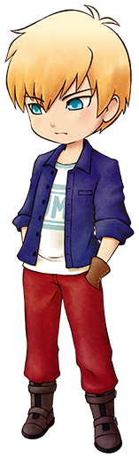

# 格雷

塞巴拉的孙子。在铁匠铺修行中，不过老是被塞巴拉说教，使得自己开始犹豫是否还要继续修行。

## 简略说明

- 登场：最初
- 住所：赛巴拉铁匠铺
- 性别：男
- 生日：冬 6 日（冬 23 日）
- 家庭成员：祖父（塞巴拉）

## 喜欢与讨厌的物品

- 最喜欢：烤玉米
- 很喜欢：超强体力药、超强消除疲劳药、巧克力、炒饭、铜、银、金、秘银
- 喜欢：番茄、鸡蛋、咖喱乌冬面
- 普通：黄瓜、葡萄果汁、曲奇
- 讨厌：芜菁、温泉蛋、竹笋饭、红豆
- 很讨厌：毒蘑菇、杂草、石头、空罐、长靴

## 行程

| 状况               |           | AM        |        |     |        |     |     | PM          |           |     |           |     |     |     |     |     |     |     |     | AM  |
| ------------------ | --------- | --------- | ------ | --- | ------ | --- | --- | ----------- | --------- | --- | --------- | --- | --- | --- | --- | --- | --- | --- | --- | --- |
| 6                  | 7         | 8         | 9      | 10  | 11     | 12  | 1   | 2           | 3         | 4   | 5         | 6   | 7   | 8   | 9   | 10  | 11  | 12  |
| 单身               | 一~日     | 旅馆 2 楼 | 广场   |     | 铁匠铺 |     |     |             | 旅馆 2 楼 |     |           |     |     |     |     |     |     |     |     |     |
| 单身 ①             | 一        | 旅馆 2 楼 | 铁匠铺 |     |        |     |     |             | 旅馆 2 楼 |     |           |     |     |     |     |     |     |     |     |     |
| 二、三、五、六、日 | 旅馆 2 楼 | 铁匠铺    |        |     |        |     |     | 图书馆 1 楼 |           |     | 旅馆 2 楼 |     |     |     |     |     |     |     |     |
| 四                 | 旅馆 2 楼 | 山顶      |        |     | 铁匠铺 |     |     | 图书馆 1 楼 |           |     | 旅馆 2 楼 |     |     |     |     |     |     |     |     |
| 婚后               | 一~日     | 自家      | 广场   |     | 铁匠铺 |     |     |             | 自家      |     |           |     |     |     |     |     |     |     |     |     |

①：情敌事件「玛丽&格雷」一阶段 发生后

## 多使用铁匠铺吧

毕竟是铁匠铺的见习工，格雷是很喜欢矿石的。

能在「泉之采矿场」挖掘到的「铜」和「银」，在「湖之采矿场」挖掘到的「绿松石」和「海蓝宝石」，都很容易获得，比较适合拿来送礼。

要注意的是，「废矿石」可是他不喜欢的东西。

如果想和他的关系更进一步，多多使用铁匠铺吧。

使用一定次数的道具的改造以及加工等服务的话，和格雷的好感度也会上升。

在「泉之采矿场」获得「山铜」的话，推荐做成项链之类的首饰再送给格雷。

### 满足一定条件后好感度上升

| 铁匠铺的订单次数 | 格雷的好感度 |
| ---------------- | ------------ |
| 15 次以上        | +2500        |
| 25 次以上        | +2500        |
| 35 次以上        | +2500        |
| 45 次以上        | +2500        |
| 55 次以上        | +2500        |

## 居民事件

- [格雷与凯的友情](../../event/resident#格雷与凯的友情)

## 恋爱事件

相遇好感度 0 以上

- 星期：二、五、六、日
- 天气：-
- 时间：AM10:00 ～ PM1:00
- 地点：铁匠铺
- 其他条件：格雷和塞巴拉在铁匠铺里
- 结果：

  修习就是这么回事。 → +3000

  既然如此，就放弃吧？ → -2000

朋友 1 好感度 5000 以上

- 星期：二、四、六、日
- 天气：-
- 时间：PM5:00 ～ PM10:00
- 地点：旅馆 2 楼
- 其他条件：格雷在旅馆 2 楼
- 结果：

  真了不起啊 → +3000

  理所应当的 → -2000

朋友 2 好感度 10000 以上

- 星期：一
- 天气：晴
- 时间：AM6:00 ～ PM12:00
- 地点：主人公的牧场
- 其他条件：

  拥有大背包或整理架

  背包里有空位

- 结果：

  有啊！ → +3000

  完全没兴趣 → -2000

朋友 3 好感度 20000 以上

- 星期：一
- 天气：-
- 时间：AM10:00 ～ PM1:00
- 地点：铁匠铺
- 其他条件：格雷和塞巴拉在铁匠铺里
- 结果：

  当然！ → +3000

  不知道… → -2000

告白好感度 30000 以上

- 送出「永生花」。

恋人/知己 1 好感度 40000 以上

- 星期：一
- 天气：-
- 时间：AM10:00 ～ PM1:00
- 地点：铁匠铺
- 其他条件：道具栏里有镰刀
- 结果：

  真帅啊 → +3000

  明明不需要在意的 → -2000

恋人/知己 2 好感度 50000 以上

- 星期：-
- 天气：晴
- 时间：AM10:00 ～ PM1:00
- 地点：主人公的牧场
- 其他条件：-
- 结果：

  你已经驾重就轻了 → +3000

  还不够成熟的说 → -2000

求婚好感度 60000 以上

- 自己家里有「大床」。
- 送出「蓝色羽毛」。

结婚·知己之仪

- 求婚成功的一周后。
- 结果：

  参加仪式的居民亲密度+20

  塞巴拉亲密度达到最大值

称呼

- 和对象结婚以后。
- 结果：对方会以自己选择的称呼来叫自己
