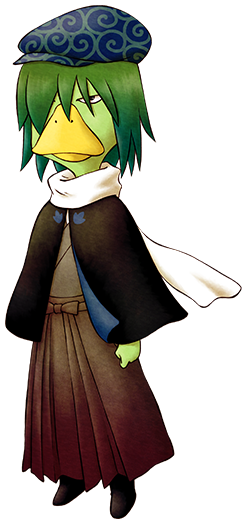

# 河童

悄悄地住在圣母山的湖中沉稳的河童。

在冬天之外的季节里，往湖里扔黄瓜就能见到他。

不太爱说话，几乎看不出感情变化。

## 简略说明

- 登场：往湖里扔黄瓜
- 住所：圣母山脉
- 性别：男
- 生日：春 8 日（春 9 日）
- 家庭成员：无

## 行程

- 冬季之外：湖
- 冬季：不在

## 喜欢的东西只有黄瓜

河童的最爱是「黄瓜」。这是能在春天播种的，从第 10 天开始能连续收获的作物。

在春季里多多种植，为了在夏秋两季也能每日送礼，多在冰箱里储存一些比较好。

河童总是在湖里，所以冬天湖面冻住以后就见不到了。

但成为伴侣以后，每逢结婚纪念日等事件的时候，他都会来自己家和自己见面。

「黄瓜」之外全部被当成垃圾，即使扔进湖里河童也不会现身。

「黄瓜」太多了的话，储存在冰箱里吧。

## 居民事件

- [河童的供品 1](../../event/resident#河童的供品1)
- [河童的供品 2](../../event/resident#河童的供品2)
- [河童的供品 3](../../event/resident#河童的供品3)
- [获得河童的秘宝](../../event/resident#获得河童的秘宝)
- [河童的灾难](../../event/resident#河童的灾难)

## 如何和河童结婚

想和河童成为伴侣的话，必须达成好几个高难度的条件。

想要出货全部的鸡蛋和动物毛的话，必须在斗鸡节和软绵绵节获得优胜。

矿石的话不仅有各种稀有的矿石，还必须获得第 3 年开始才能开采到的「飞行石」。

以成为伴侣为目标，努力到最后吧！

### 求婚成功条件

- 事件「给女神大人的供品 2」里，喜欢的对象选择「河童」
- 在教堂的忏悔里选「想和河童结婚」并获得原谅
- 事件「女神大人第 2」触发（出货全部能出货的物品）
- 事件「女神大人第 3」触发（钓全部种类的鱼）
- 事件「女神大人第 4」触发（发现「泉之采矿场」和「湖之采矿场」里的全部物品）
- 获得「河童的秘宝」
- 第 5 年以后
- 河童的好感度在 60000 以上
- 自己家里有「大床」

满足上述全部条件后，在湖边使用「蓝色羽毛」

要追河童的话，当女神问你喜欢谁的时候，一定要选「河童」

冬天之外每天都送黄瓜的话，大约 1 年好感度就能过 6 万。

### 在忏悔室获得原谅吧

想和河童成为伴侣的话，必须在教堂的忏悔中选择想和河童结婚并获得原谅。

只有当卡特在忏悔室里时才能够忏悔，并且一天一次。

内容是随机的，只有 1/50 的概率会出现「想和河童结婚」的选项。

获得原谅的概率更是只有 1/100，想要获得原谅就多去教堂试试吧。

~~S/L 大法了解一下？~~

只有下雨天和周一、周三的 PM1:00 ～ PM3:00 之间，卡特才会在忏悔室。

获得原谅不容易，不要气馁！

## 不可思议树之果实

给河童 10 次「黄瓜」就可以从河童那里获得「不可思议树之果实」。

这颗果实的效果是可以使疲劳度积攒速度减半，十分有用。

获得后晚上 10:00 以后或是雨天雪天都可以做更多的事了。

春天收获黄瓜后就开始送礼吧。

获得后就会在菜单选项「牧场资讯」中以绿色的心来表示。

## 获得河童的秘宝吧

在「湖之采矿场」获得 9 个「河童之玉」的话，就能获得「河童的秘宝」。

另外，没有「飞行石」的话只有冬天才能去「湖之采矿场」。

### 「河童之玉」的出现位置（湖之采矿场）

- 地上 1 层
- 地下 40 层
- 地下 60 层
- 地下 80 层
- 地下 120 层
- 地下 140 层
- 地下 160 层
- 地下 180 层
- 地下 255 层
