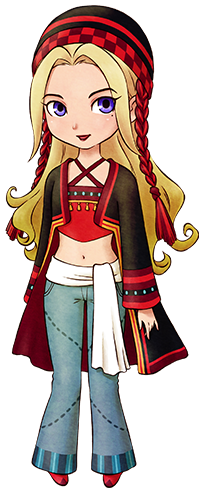

# 珍妮弗

因为喜欢矿石镇的自然环境而在湖边搭了个帐篷。

似乎能从人和自然感受到能量。

## 简略说明

- 登场：最初
- 住所：帐篷
- 性别：女
- 生日：冬 2 日（冬 18 日）
- 家庭成员：无

## 喜欢与讨厌的物品

- 最喜欢：栗子饭、烤栗子、蒙布朗蛋糕
- 很喜欢：巧克力、番薯、曲奇、巧克力曲奇、布丁、玛德莲蛋糕
- 喜欢：芜菁、蜂蜜、油、烤玉米
- 普通：温泉蛋、苹果、蓝草、大阪烧
- 讨厌：芝士、芝士蛋糕、小型鱼
- 很讨厌：毒蘑菇、石头、空罐、长靴、鱼骨

## 行程

| 状况                 |           | AM        |           |           |     |                 |          | PM          |     |           |           |           |           |     |           |           |     |     |     | AM  |
| -------------------- | --------- | --------- | --------- | --------- | --- | --------------- | -------- | ----------- | --- | --------- | --------- | --------- | --------- | --- | --------- | --------- | --- | --- | --- | --- |
| 6                    | 7         | 8         | 9         | 10        | 11  | 12              | 1        | 2           | 3   | 4         | 5         | 6         | 7         | 8   | 9         | 10        | 11  | 12  |
| 单身                 | 一        | 旅馆 2 楼 |           | 后山·帐篷 |     |                 |          | 养鸡场 1 楼 |     |           |           | 后山·帐篷 |           |     |           | 旅馆 2 楼 |     |     |     |     |
| 二                   | 旅馆 2 楼 |           | 后山·帐篷 |           |     | 约德尔牧场 1 楼 |          |             |     | 后山·帐篷 |           |           |           |     | 旅馆 2 楼 |           |     |     |     |
| 三、四、五、六       | 旅馆 2 楼 |           | 后山·帐篷 |           |     |                 | 秘密森林 |             |     |           | 后山·帐篷 |           |           |     | 旅馆 2 楼 |           |     |     |     |
| 日                   | 旅馆 2 楼 |           | 秘密森林  |           |     |                 |          | 海边        |     |           |           |           | 旅馆 1 楼 |     |           | 旅馆 2 楼 |     |     |     |
| 雨、雪（与星期无关） | 旅馆 2 楼 |           |           |           |     | 后山·帐篷       |          |             |     |           |           |           |           |     | 旅馆 2 楼 |           |     |     |     |
| 婚后                 | 一        | 自家      |           | 后山·帐篷 |     |                 |          | 养鸡场 1 楼 |     |           |           | 后山·帐篷 |           |     |           | 自家      |     |     |     |     |
| 二                   | 自家      |           | 后山·帐篷 |           |     | 约德尔牧场 1 楼 |          |             |     | 后山·帐篷 |           |           |           |     | 自家      |           |     |     |     |
| 三、四、五、六       | 自家      |           | 后山·帐篷 |           |     | 秘密森林        |          |             |     |           | 后山·帐篷 |           |           |     | 自家      |           |     |     |     |
| 日                   | 自家      |           | 秘密森林  |           |     |                 |          | 海边        |     |           |           |           | 自家      |     |           |           |     |     |     |
| 雨、雪（与星期无关） | 自家      |           |           |           |     |                 |          |             |     |           |           |           |           |     |           |           |     |     |     |

## 喜欢栗子做的食品和甜品

珍妮弗最喜欢用「栗子」做的食品。栗子能在秋天的圣母山脉的山腰捡到。

不容易获得「栗子」的时候，可以送一些像「巧克力」和「曲奇」的甜点。

她对全部的矿石都不喜欢，所以即便是很贵的东西也不要送给她。

到了秋天时，去后山捡「栗子」吧！

## 居民事件

- [珍妮弗的礼物](../../event/resident#珍妮弗的礼物)

## 恋爱事件

相遇好感度 0 以上

- 星期：一、二、三、四、五、六
- 天气：晴
- 时间：AM10:00 ～ AM12:00
- 地点：后山
- 其他条件：-
- 结果：

  你在说什么啊…… → -2000

  嗯，很舒服 → +3000

朋友 1 好感度 5000 以上

- 星期：二、三、四、五、六
- 天气：晴
- 时间：AM10:00 ～ AM12:00
- 地点：后山
- 其他条件：和巴吉尔不是初次见面
- 结果：

  每个人的看法不同 → -2000

  真不错的解释呢 → +3000

朋友 2 好感度 10000 以上

- 星期：一、二、三、四、五、六
- 天气：晴
- 时间：AM10:00 ～ AM12:00
- 地点：后山
- 其他条件：-
- 结果：

  像天使的名字 → +3000

  像魔法的名字 → 无变化

  总之取个高贵的名字 → -2000

朋友 3 好感度 20000 以上

- 星期：一、二、三、四、五、六
- 天气：-
- 时间：AM11:00 ～ PM4:000
- 地点：养鸡场 1 楼
- 其他条件：拥有大背包或整理架 背包里有空位
- 结果：

  原来你不是天然呆啊 → -2000（莉莉娅亲密度-10）

  好温柔啊 → +3000（莉莉娅亲密度+20）

告白好感度 30000 以上

- 送出「永生花」。

恋人/知己 1 好感度 40000 以上

- 星期：-
- 天气：晴
- 时间：AM10:00 ～ PM4:000
- 地点：后山/帐篷
- 其他条件：-
- 结果：

  你父母一定在担心你啊 → -2000

  自己的幸福是最重要的 → +3000

恋人/知己 2 好感度 50000 以上

- 星期：-
- 天气：-
- 时间：PM7:00 ～ PM9:00
- 地点：旅馆 2 楼
- 其他条件：-
- 结果：

  这很难说啊… → -2000

  我会尽量不让你担心的 → +3000

求婚好感度 60000 以上

- 自己家里有「大床」。
- 送出「蓝色羽毛」。

结婚·知己之仪

- 求婚成功的一周后。
- 结果：参加仪式的居民亲密度+20

称呼

- 和对象结婚以后。
- 结果：对方会以自己选择的称呼来叫自己。
