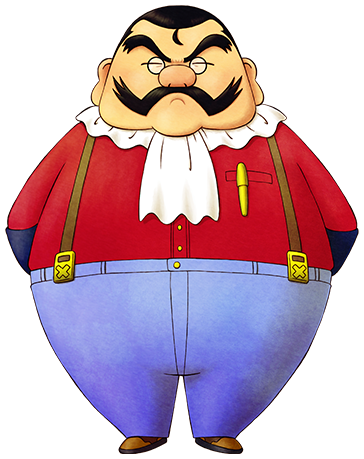

# 班

矿石镇的行脚商。会带来很珍贵的商品。  
每周三会在达特的旅馆二楼开店。

- 登场：经过事件（来打招呼的班）
- 住所：不明
- 性别：男
- 生日：不明
- 家庭成员：不明

## 喜欢与讨厌的物品

- 最喜欢：X 型毛线团、粉红钻石、亚历山大石、钻石、海盗宝藏
- 喜欢：凤梨、P 型牛奶、体力药、消除疲劳的药、铜、银、金
- 普通：芜菁、番茄、鸡蛋、青草
- 讨厌：月落草、粉色猫薄荷草
- 最讨厌：杂草、空罐、长靴、鱼骨

## 行程

| 状况                        | AM        |     |     |     |     |     | PM   |     |     |     |     |     |           |     |     |     |     |     | AM  |
| --------------------------- | --------- | --- | --- | --- | --- | --- | ---- | --- | --- | --- | --- | --- | --------- | --- | --- | --- | --- | --- | --- |
| 6                           | 7         | 8   | 9   | 10  | 11  | 12  | 1    | 2   | 3   | 4   | 5   | 6   | 7         | 8   | 9   | 10  | 11  | 12  |
| 三                          | 旅馆 2 楼 |     |     |     |     |     |      |     |     |     |     |     |           |     |     |     |     |     |     |
| 每月 15 日                  | 不在      |     |     |     |     |     | 广场 |     |     |     |     |     | 不在      |     |     |     |     |     |     |
| 每月 15 日·三 ①             | 旅馆 2 楼 |     |     |     |     |     | 广场 |     |     |     |     |     | 旅馆 2 楼 |     |     |     |     |     |     |
| 每月 15 日·三（雨、雪）①    | 旅馆 2 楼 |     |     |     |     |     |      |     |     |     |     |     |           |     |     |     |     |     |     |
| 三以外·每月 15 日（雨、雪） | 不在      |     |     |     |     |     |      |     |     |     |     |     |           |     |     |     |     |     |     |

①：指每月的 15 日并且是星期三的情况

## 买了矿石当场送他吧

送女神 30 次礼物，班就会每周三在达特的店的二楼开店。

并且，每月 15 日会在广场开宠物店。

作为旅行商人的班，最喜欢 X 型毛线团、钻石等难以获得的珍贵品。

喜欢所有矿石，所以比较推荐从他那里买铜、金、银再当场送给他。

送他东西的时候，站在他旁边递给他。

如果送给他「班最喜欢的东西」，便可以从他那里买到珍贵的商品。

## 居民事件

- [班的问候](../../event/resident#班的问候)
