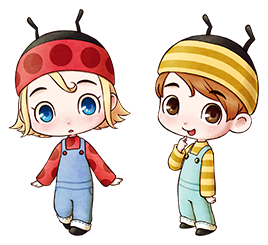

# 主人公的孩子

主人公和伴侣结婚或者成为知己之后出现的孩子。

会经历婴儿、爬行、走路三个阶段。

- 登场：  
  事件（出生）  
  事件（女神大人送来孩子）

## 喜欢与讨厌的物品

### 爬行阶段

- 最喜欢：葡萄果汁、乌冬面、蛋糕
- 喜欢：胡萝卜、巧克力、红豆
- 普通：爆米花、蛋包饭、石锅拌饭
- 讨厌：洋葱、青椒、曲奇
- 最讨厌：羊毛、铜、银、金、项链

### 走路阶段

- 最喜欢：葡萄果汁、蛋包饭、曲奇、石锅拌饭
- 喜欢：巧克力、爆米花
- 普通：南瓜、乌冬面、长靴
- 讨厌：芜菁、土豆、铜、银、金
- 最讨厌：洋葱、胡萝卜、红豆

## 长大后喜恶会发生变化

婴儿或者幼年阶段，都会整天呆在家中，如果想见的话就回家吧。

在婴儿阶段时，什么也无法递给他（她），等 ta 幼年再送 ta 礼物吧。

从爬行到走路后，喜欢的东西也会变化。以前喜欢的食物可能还会变得讨厌。

但是葡萄果汁和冰淇淋是什么时候 ta 都喜欢的，所以多准备点吧。

爬行状态除了食物，还很喜欢毛线团。

蹒跚走路阶段，可以吃硬一点的食物了。
