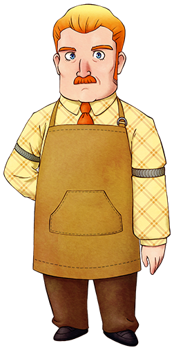

# 达特

旅馆的主人，妻子先行离世，独自一人将女儿兰抚养长大。

很担心对恋爱迟钝的女儿，也有爱操心的一面。

- 登场：最初
- 住所：达特的店
- 性别：男
- 生日：冬 11 日
- 家庭成员：女儿（兰）

## 喜欢与讨厌的物品

- 最喜欢：洋葱、鸡蛋、牛奶、蜂蜜、小麦粉、烤苹果、小型鱼、中型鱼、大型鱼
- 喜欢：玉米、温泉蛋、紫草、冰淇淋、布丁
- 普通：芜菁、葡萄果汁、炒饭
- 讨厌：红草、黄草、月落草
- 最讨厌：毒蘑菇、杂草、石头、鱼骨

## 行程

| 状况  | AM           |     |           |     |     |     | PM  |              |     |           |     |     |     |              |     |           |     |     | AM  |
| ----- | ------------ | --- | --------- | --- | --- | --- | --- | ------------ | --- | --------- | --- | --- | --- | ------------ | --- | --------- | --- | --- | --- |
| 6     | 7            | 8   | 9         | 10  | 11  | 12  | 1   | 2            | 3   | 4         | 5   | 6   | 7   | 8            | 9   | 10        | 11  | 12  |
| 一~日 | 旅馆 1 楼·里 |     | 旅馆 1 楼 |     |     |     |     | 旅馆 1 楼·里 |     | 旅馆 1 楼 |     |     |     | 旅馆 1 楼·里 |     | 旅馆 1 楼 |     |     |     |

## 喜欢料理的食材

达特喜欢所有蛋类和牛奶类，也喜欢所有型号的鱼。

杂货店的食材也全都很喜欢，推荐送他比较容易获得的小麦粉。

对于全年无休的他来说，体力药也是很不错的礼物。

提升他的亲密度可以进入旅馆里屋。

要送礼物的时候进到柜台里面递给他吧。

比起温泉蛋和玉子烧，更喜欢未加工的鸡蛋。

## 居民事件

- [克里夫倒下](../../event/resident#克里夫倒下)
- [卡莲和狄克的果汁比拼](../../event/resident#卡莲和狄克的果汁比拼)
- [给父亲的礼物](../../event/resident#给父亲的礼物)
- [乔安娜的任性](../../event/resident#乔安娜的任性)
- [乔安娜打来的电话](../../event/resident#乔安娜打来的电话)
- [兰母亲的忌日](../../event/resident#兰母亲的忌日)
- [达特和狄克的争执](../../event/resident#达特和狄克的争执)
