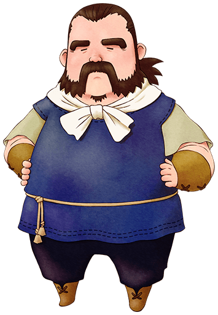

# 哥兹

擅长木工的木匠。增修建房屋的话就找他吧。  
他让倒在山上的布兰登留宿他家、说明他是个很宽容善良的人。

- 登场：最初
- 住所：木匠的家
- 性别：男
- 生日：秋 2 日
- 家庭成员：无

## 喜欢与讨厌的物品

- 最喜欢：土豆、洋葱、鸡蛋、蛋黄酱、蜂蜜、小麦粉
- 喜欢：牛奶、体力药、巧克力、巧克力曲奇
- 普通：芜菁、茄子、温泉蛋、蓝草、饼干
- 讨厌：丸子粉、烤玉米、玛瑙
- 最讨厌：毒蘑菇、红草、装信的瓶子

## 行程

| 状况       | AM       |      |     |     |          |     | PM  |              |     |     |          |     |     |     |     |     |     |     | AM  |
| ---------- | -------- | ---- | --- | --- | -------- | --- | --- | ------------ | --- | --- | -------- | --- | --- | --- | --- | --- | --- | --- | --- |
| 6          | 7        | 8    | 9   | 10  | 11       | 12  | 1   | 2            | 3   | 4   | 5        | 6   | 7   | 8   | 9   | 10  | 11  | 12  |
| 一、二、三 | 伐木之家 | 湖边 |     |     | 伐木之家 |     |     |              |     |     |          |     |     |     |     |     |     |     |     |
| 四、五     | 伐木之家 | 湖边 |     |     | 伐木之家 |     |     | 伐木之家附近 |     |     | 伐木之家 |     |     |     |     |     |     |     |     |
| 六         | 伐木之家 | 湖边 |     |     | 镇长家   |     |     | 杂货店       |     |     | 伐木之家 |     |     |     |     |     |     |     |     |
| 日         | 伐木之家 |      |     |     |          |     |     | 山顶         |     |     | 伐木之家 |     |     |     |     |     |     |     |     |

## 最容易送的是鸡蛋

哥兹喜欢所有蛋类，还有蛋黄酱、芝士。什么型号都可以，就送最容易获得的吧。

杂货店可以买到的油、小麦粉、咖喱粉也很推荐。蜂蜜、苹果、蜜蜂他也最喜欢。

增改筑的时候，用牧场砍下的木材作为礼物送给他也不错哦。

哥兹虽然喜欢羊、羊驼等动物的毛，但是却不太喜欢毛线团。

如果拜托了他增改筑，他会从开始到结束一直在主人公牧场里工作。

## 居民事件

- [哥兹的低落](../../event/resident#哥兹的低落)
- [哥兹不再低落](../../event/resident#哥兹不再低落)
- [代替巡山](../../event/resident#代替巡山)
