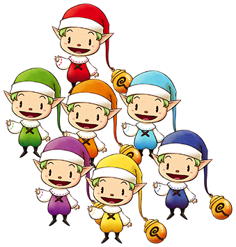

# 七个小矮人

矿石镇北侧小屋的七个小矮人。

看起来长得一模一样，但是性格和喜好每个人都不同。

被称作小矮人其实是翻译的问题（neta.白雪公主和七个小矮人）

实际上他们的种族应该是精灵（Elf），而不是矮人（Dwarf）

《矿石镇的伙伴们》的续作《精灵驿站》，标题中的精灵就是指它们。

## 卓卡克

蓝色衣服，喜欢工作。

七个人中最优秀的优等生。

会认真对待工作。

- 登场：最初
- 生日：春 15 日
- 最喜欢：蓝草、面包、草莓牛奶、巧克力曲奇

## 纳比

橙色衣服，充满活力。

比起工作更喜欢玩耍。

- 登场：最初
- 生日：冬 22 日
- 最喜欢：苹果、橙草、葡萄果汁、面包

## 波尔多

紫色衣服，对体力自信。

太过自信所以有时会有点任性。

- 登场：最初
- 生日：春 4 日
- 最喜欢：土豆、卷心菜、紫草、饭团

## 谢夫涅

红色衣服，沉着的性格。

喜欢照顾人，勤恳的类型。

最喜欢做料理。

- 登场：最初
- 生日：秋 14 日
- 最喜欢：番茄、苹果、红草、面包、番茄酱

## 阿库娅

因为喜欢时尚所以不喜欢会弄脏衣服的工作。

- 登场：最初
- 生日：春 26 日
- 最喜欢：山葡萄的果实、丸子粉、冰淇淋

## 古里笛

黄色衣服，贪吃鬼。

吊儿郎当游手好闲，还经常向主人公讨吃的。

- 登场：最初
- 生日：秋 10 日
- 最喜欢：温泉蛋、黄草、牛奶、生鱼片

## 迪米特

绿色衣服，懦弱老实。

比较容易累。

- 登场：最初
- 生日：夏 16 日
- 最喜欢：绿草、巧克力、咖喱饭

## 准备小麦粉吧！

虽然小矮人整天都会呆在家中，但是如果请他们帮忙的话会在 AM6:00 ～ PM6:00 一直在牧场里。

虽然七个人喜欢不太一样，但是都喜欢「小麦粉」。

让他们工作会减少少许亲密度，所以在杂货店多买点「小麦粉」，作为礼物送给他们吧。

跟他们关系变好的话可以请他们帮忙干活。

## 能委托工作的小矮人

小矮人一共有 7 位，亲密度达到以上的时候就可以委托工作了。

能委托的工作有 3 种，分别是浇水、收获、照顾动物，能选择的工作时间分别是 1 天、3 天、7 天。

想要取消已经委托好的工作时，需要在小矮人在牧场工作的时候和他们对话，然后选择「工作做到今天就可以了」。

另外，小矮人的亲密度变动的要素与居民是一样的，除此之外还有一点普通居民不同，

那就是委托工作之后，小矮人每天工作结束后，亲密度都会减少 2 点。

想要委托工作的话，就要去小矮人的家。

决定好工作的种类及天数后，第二天小矮人就会来牧场开始工作。

### 能委托的工作

- 浇水：小矮人能帮我们给农作物浇水，田里没有农作物的时候小矮人就会开始玩耍。
- 收获：田里只要有成熟的农作物小矮人就会收获，收获的农作物会直接出货。
- 照顾动物：小矮人会帮我们放饲料、刷毛、获取农副产品并且出货。

#### 提高亲密度及工作能力就可以提高效率

小矮人会在工作中睡觉、游玩，但是提高亲密度的话他们偷懒的几率也会降低。

另外，委托工作的话，就会提高对应工作得能力。

在偷懒时间减少的同时，移动的速度也会提高从而提高工作效率。

小矮人都是 AM6:00 开始工作，到 PM6:00 结束工作。

即使工作没做完也会回家。

但是，只要工作的能力提高，在规定时间内的工作量就会提高，最后会成为很可靠的存在。

浇水的能力超过 80%的话，1 人 1 天就可以浇 12 个 3x3 的方框这样大的范围。

### 小矮人的工作能力值

↑ 可以在菜单选项中「交流资讯」的小矮人一栏确认。

从上到下显示的工作能力值分别是浇水、收获、照顾动物。

工作能力值的变化带来的行动变化

| 工作能力值 | 移动速度 | 偷懒时间 |
| ---------- | -------- | -------- |
| 0 ～ 20%   | 1 倍     | 12 秒    |
| 21 ～ 40%  | 1 倍     | 8 秒     |
| 41 ～ 60%  | 1.25 倍  | 8 秒     |
| 61 ～ 80%  | 1.5 倍   | 4 秒     |
| 81 ～ 100% | 2 倍     | 4 秒     |

## 3 种迷你游戏

亲密度达到3 以上的时候，每天都有 1 次机会和小矮人玩迷你游戏。

3 种迷你游戏分别都对应着小矮人的工作，每个迷你游戏都设定了通关分数，达到了这个分数后游戏所对应的工作能力值就会上升。

但是，没有通关的话工作能力值就会下降，因此建议在进行游戏之前先保存一下。

另外，每个迷你游戏在通关次数达到一定量的时候难度就会上升。

通关所需的分数会提高，而根据结果工作能力值的增减幅度也会增大。

想挑战迷你游戏的话，就在对话时选择「一起来玩吧」，然后选择游戏种类。

### 迷你游戏的通关分数

| 通关次数    | 浇水 | 收获 | 照顾动物 |
| ----------- | ---- | ---- | -------- |
| 不满 3 次   | 9    | 2    | 10       |
| 3 ～ 5 次   | 12   | 3    | 15       |
| 6 ～ 8 次   | 15   | 4    | 20       |
| 9 ～ 10 次  | 18   | 5    | 30       |
| 11 ～ 13 次 | 21   | 7    | 35       |
| 14 ～ 16 次 | 24   | 9    | 45       |
| 17 ～ 19 次 | 27   | 10   | 55       |
| 20 次以上   | 30   | 11   | 60       |

### 迷你游戏的效果（工作能力值）

| 通关次数    | 成功 | 失败 |
| ----------- | ---- | ---- |
| 0 ～ 5 次   | +1   | -1   |
| 6 ～ 10 次  | +2   | -2   |
| 11 ～ 16 次 | +3   | -3   |
| 17 次以上   | +4   | -4   |

### 迷你游戏的内容

#### 浇水

在限制时间内，将水浇到和示范一样的方框里，成功就加分，失败就扣分，浇水的顺序正确的话会有奖励分。

把示范下来是个好办法，在纸上画 5x5 的方框然后做笔记也不失为一个好办法。

#### 收获

连续按下 A 键将作物拔起，在限定时间内拔起一定数量的作物就算通关。按得太快就会失败，因此大家要调节好速度。

当出现了汗水淋淋的标志时，就适当降低按键的速度吧。

#### 照顾动物

左右移动在饲料箱里放饲料。在限定的时间内喂食一定数量的鸡就算通关。

饲料吃完鸡就会走出小屋，走出小屋就扣分，因此请大家估计好饲料马上就要吃完的地方，然后快速投放饲料吧。

饲料一减少马上就要补上。根据饲料的量来预测下一个必须投放点。

即使吃完饲料公鸡开始走动了也不要慌张，只要在公鸡走出小屋前把饲料放好，公鸡就会回来，这样就不会扣分。
