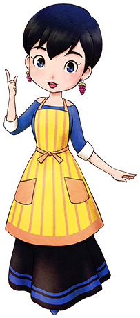

# 玛娜

狄克的妻子。很喜欢聊天，白天就在玫瑰广场和安娜，莎夏等人说说闲话。

- 登场：最初
- 住所：安洁庄园
- 性别：女
- 生日：秋 11 日
- 家庭成员：丈夫（狄克）

## 喜欢与讨厌的物品

- 很喜欢：凤梨、蜂蜜、金蛋、丸子粉、蔬菜汁、葡萄面包、小型鱼
- 喜欢：芜菁、青椒、鸡蛋、甜蜜烤番薯、曲奇、红宝石
- 普通：玉米、高级葡萄果汁
- 讨厌：蘑菇、青草、咖喱饭
- 很讨厌：铜、银、金、秘银、沙漠玫瑰石

## 行程

| 状况                 | AM          |             |     |     |               |     | PM  |           |     |     |             |     |     |             |     |     |             |     | AM  |
| -------------------- | ----------- | ----------- | --- | --- | ------------- | --- | --- | --------- | --- | --- | ----------- | --- | --- | ----------- | --- | --- | ----------- | --- | --- |
| 6                    | 7           | 8           | 9   | 10  | 11            | 12  | 1   | 2         | 3   | 4   | 5           | 6   | 7   | 8           | 9   | 10  | 11          | 12  |
| 一~五、日            | 果树园 2 楼 | 果树园 1 楼 |     |     |               |     |     | 广场      |     |     | 果树园 1 楼 |     |     |             |     |     | 果树园 2 楼 |     |     |
| 雨、雪（与星期无关） | 果树园 2 楼 | 果树园 1 楼 |     |     |               |     |     | 杂货店    |     |     | 果树园 1 楼 |     |     |             |     |     | 果树园 2 楼 |     |     |
| 六                   | 果树园 2 楼 | 果树园 1 楼 |     |     | 巴吉尔家 1 楼 |     |     | 广场      |     |     | 果树园 1 楼 |     |     |             |     |     | 果树园 2 楼 |     |     |
| 六                   | 果树园 2 楼 | 果树园 1 楼 |     |     | 巴吉尔家 1 楼 |     |     | 旅馆 1 楼 |     |     | 教堂        |     |     | 果树园 1 楼 |     |     | 果树园 2 楼 |     |     |

①：居民事件「果树园打工」发生后（克里夫在果树园工作）

## 容易送的礼物是「蜂蜜」

除了下雨下雪的日子，每天午后都在广场开太太会。

克里夫到果树园工作之后，玛娜的星期六日程有很大的变化。

礼物的话除了牧场能采到的「蜂蜜」以外，杂货屋能买到的「丸子粉」也是推荐项目。

喜欢不喜欢的东西会很明白地被告之，真容易懂啊。

不管什么型号的蛋黄酱，玛娜都会欢心收下。

## 居民事件

- [散步的布兰登](../../event/resident#散步的布兰登)
- [卡莲和狄克的果汁比拼](../../event/resident#卡莲和狄克的果汁比拼)
- [果树园打工](../../event/resident#果树园打工)
- [夫妻争执](../../event/resident#夫妻争执)
- [擅长购物的玛娜](../../event/resident#擅长购物的玛娜)
- [安娜的点心教室 1](../../event/resident#安娜的点心教室1)
- [安娜的点心教室 2](../../event/resident#安娜的点心教室2)
- [莎夏的人生咨询](../../event/resident#莎夏的人生咨询)
