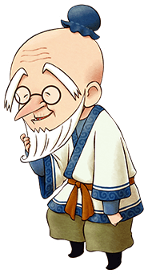

# 穆奇

梅的祖父、约德尔牧场的主人。  
非常喜欢温泉，休息日会和孙女梅一起去圣母山脉的温泉。

- 登场：最初
- 住所：约德尔牧场
- 性别：男
- 生日：春 17 日
- 家庭成员：孙女（梅）

## 喜欢与讨厌的物品

- 很喜欢：温泉蛋、饭团、味噌汤、玉子烧、乌冬面、荞麦面、年糕、大福
- 喜欢：芜菁、胡萝卜、鸡蛋、牛奶、葡萄果汁、生鱼片
- 普通：马铃薯、苹果、面包、炒饭
- 讨厌：凤梨、炸薯条、曲奇
- 很讨厌：黄草、超强体力药、咖喱粉

## 行程

| 状况         | AM         |     |                 |     |     |     | PM  |                 |     |     |                 |     |     |                 |     |     |     |     | AM  |
| ------------ | ---------- | --- | --------------- | --- | --- | --- | --- | --------------- | --- | --- | --------------- | --- | --- | --------------- | --- | --- | --- | --- | --- |
| 6            | 7          | 8   | 9               | 10  | 11  | 12  | 1   | 2               | 3   | 4   | 5               | 6   | 7   | 8               | 9   | 10  | 11  | 12  |
| 一           | 约德尔牧场 |     | 镇长家          |     |     |     |     | 温泉附近        |     |     | 约德尔牧场 1 楼 |     |     | 约德尔牧场 2 楼 |     |     |     |     |     |
| 一（雨、雪） | 约德尔牧场 |     | 镇长家          |     |     |     |     | 约德尔牧场 1 楼 |     |     | 约德尔牧场 2 楼 |     |     |                 |     |     |     |     |     |
| 二~日        | 约德尔牧场 |     | 约德尔牧场 1 楼 |     |     |     |     |                 |     |     |                 |     |     | 约德尔牧场 2 楼 |     |     |     |     |     |

## 送他和风的食物吧

一直都呆在约德尔牧场里，但是星期一的 PM1:00 ～ PM3:00 会带着梅一起到后山的温泉去，这个时间要是想见到穆奇的话就去温泉吧。

推荐制作他喜欢的温泉蛋当作礼物送给他。

其他比如「饭团」、「荞麦面」、「年糕」等和风的食物穆奇也喜欢。

「饭团」的话杂货店有售喔，芝士和快餐系的食物不是很对他的胃口、请注意不要送给他。

「饭团」100G 一个，有富余的钱的话，就去批发吧。

穆奇的亲密度提高了的话、就可以到约德尔牧场的二楼。

## 居民事件

- [海之家繁盛日记](../../event/resident#海之家繁盛日记)
- [收留马](../../event/resident#收留马)
- [取回马](../../event/resident#取回马)
- [获得马](../../event/resident#获得马)
- [乔安娜的任性](../../event/resident#乔安娜的任性)
- [乔安娜打来的电话](../../event/resident#乔安娜打来的电话)
