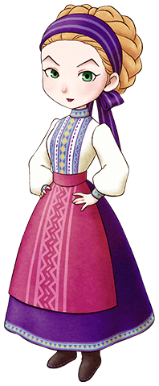

# 莎夏

杰夫的妻子，卡莲的妈妈。  
跟杰夫相反，性格很强硬。  
虽然会抱怨杰夫，但还是他坚定的追随者。

- 登场：最初
- 住所：杂货店
- 性别：女
- 生日：春 30 日
- 家庭成员：丈夫（杰夫）、女儿（卡莲）

## 喜欢与讨厌的物品

- 最喜欢：巧克力、甜蜜烤番薯、曲奇、月泪草
- 喜欢：芜菁、洋葱、青椒、鸡蛋、葡萄面包、海蓝宝石
- 普通：温泉蛋、苹果、咖喱饭
- 讨厌：芝士、芝士蛋糕、铜
- 最讨厌：毒蘑菇、翡翠、绿松石、杂草

## 行程

| 状况                | AM        |                 |     |     |             |     | PM  |        |     |     |           |     |     |     |     |     |     |     | AM  |
| ------------------- | --------- | --------------- | --- | --- | ----------- | --- | --- | ------ | --- | --- | --------- | --- | --- | --- | --- | --- | --- | --- | --- |
| 6                   | 7         | 8               | 9   | 10  | 11          | 12  | 1   | 2      | 3   | 4   | 5         | 6   | 7   | 8   | 9   | 10  | 11  | 12  |
| 一、三~日           | 杂货店·里 |                 |     |     |             |     |     | 广场   |     |     | 杂货店·里 |     |     |     |     |     |     |     |     |
| 一、三~日（雨、雪） | 杂货店·里 |                 |     |     |             |     |     | 杂货店 |     |     | 杂货店·里 |     |     |     |     |     |     |     |     |
| 二                  | 杂货店·里 | 约德尔牧场 1 楼 |     |     | 养鸡场 1 楼 |     |     | 爱莲家 |     |     | 杂货店·里 |     |     |     |     |     |     |     |     |

## 在她出门的时候送礼物吧

莎夏只在周二以外的雨雪天的 PM1:00 ～ PM3:00，才出现在杂货店卖场处。

大部分时间都在杂货店里屋，但如果提高和她的亲密度后就可以进去里屋。

等她下午出现在广场，或者周二外出时，是送礼物的好时机。

她喜欢巧克力等甜食，也喜欢粉色猫薄荷和月落草等花。

做好事先准备，以至于能在看见她的时候可以立刻送出礼物吧。

莎夏经常和女儿卡莲一起呆在里屋。

主人公牧场种植的农作物她全都喜欢。

## 居民事件

- [杰夫的绘画买卖](../../event/resident#杰夫的绘画买卖)
- [杰夫的决定](../../event/resident#杰夫的决定)
- [莎夏的人生咨询](../../event/resident#莎夏的人生咨询)
- [和杰夫的回忆](../../event/resident#和杰夫的回忆)
